# Chapter 05 - Future and CompletableFuture.

Future and CompletableFuture.

# What I learned.

# Evolution of Concurrency APIs in Java.

<div align="center">
    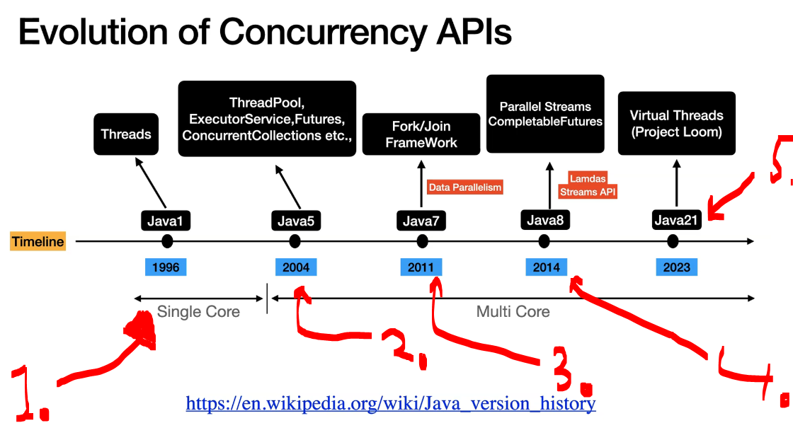
</div>

1. **Threads** were introduced in **Java 1** in 1996!
2. There was **multicore** support in **Java 5** in 2004!
3. **Java 7** brought **Data Parallelism** to the language in 2011!
4. **Java 8** functional programming world in 2014!
5. **Java 21** introduced the **Virtual Threads** in 2023!

# Parallelism VS Concurrency.

<div align="center">
    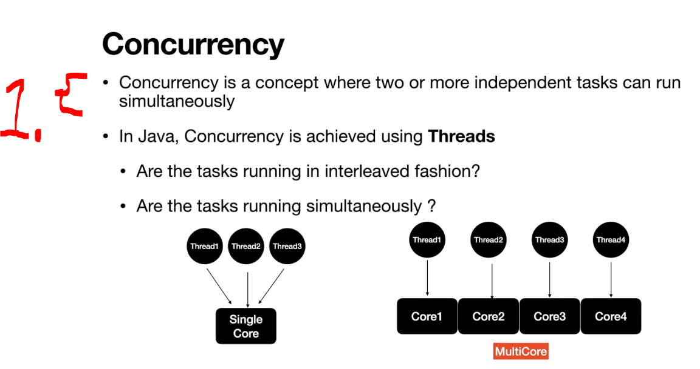
</div>


1. **Concurrency** is the ability of a system to make progress on two or more **independent** tasks during the same period of time

<div align="center">
    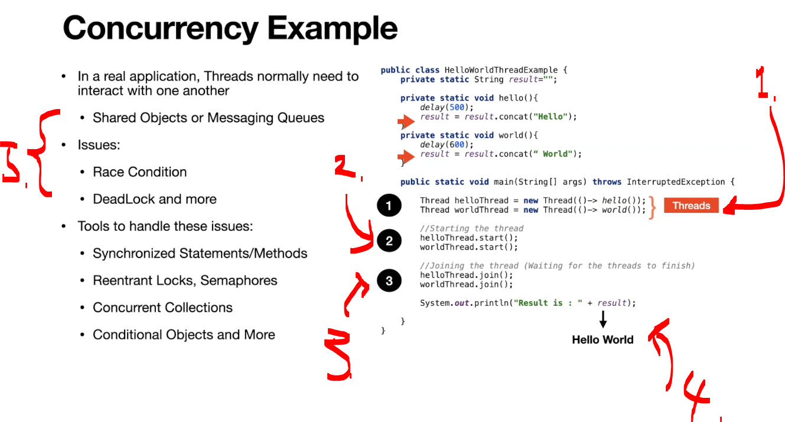
</div>

1. We will be having **two threads**!
2. We start the **threads**.
3. We make them wait, until they are finished!
4. We will be getting the *Hello Wordl* out of these operations!
5. The **Shared Object** is root of all evil!

<div align="center">
    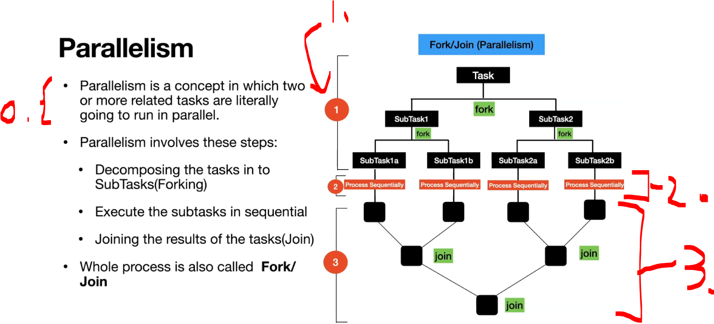
</div>

0. **Parallelism** is the simultaneous execution of two or more tasks or subtasks on multiple processors or CPU cores.
1. **First** is to brake the task into **subtask's**. 
    - This can be smallest as possible. This is called **forking**!
2. We execute the task!
3. We will be **.join(...)**!

<div align="center">
    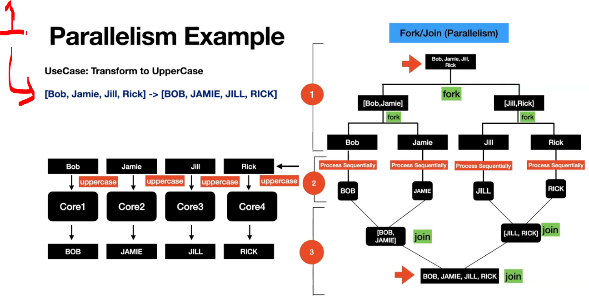
</div>

1. We will be having the **parallelism** example using the **transformation** operation!

<div align="center">
    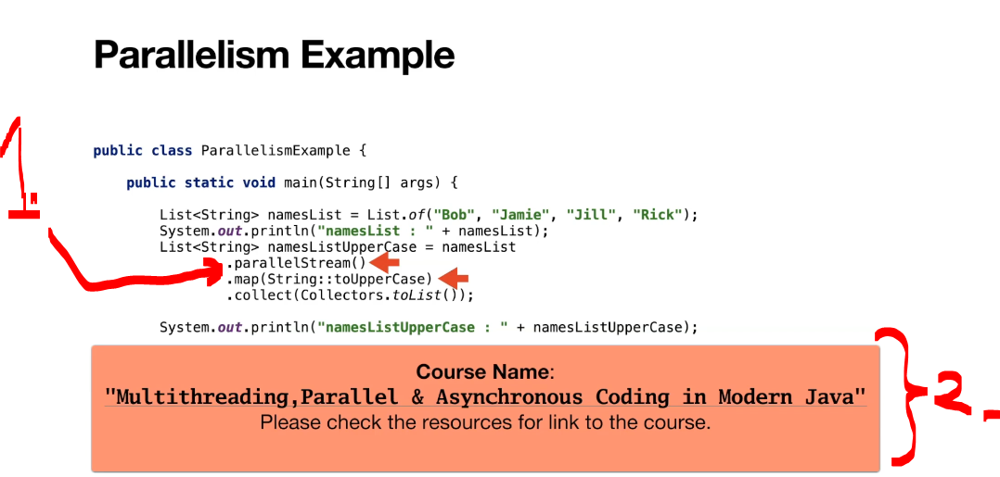
</div>

1. `.parallelStream()` splits a large task into **smaller subtasks**, processes them in **parallel** using multiple threads, and then **joins** the results!
2. [Multithreading,Parallel & Asynchronous Coding in Modern Java](https://www.udemy.com/course/parallel-and-asynchronous-programming-in-modern-java/)!

<div align="center">
    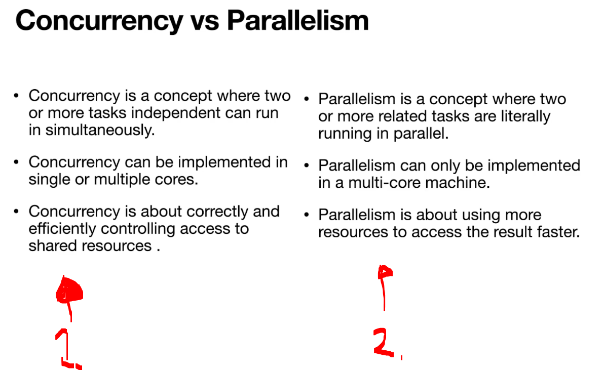
</div>

1. **Concurrency**
    - Time →
        - **Task A**: ███__ ███__ ███
        - **Task B**: __ ███__ ███
    - The CPU switches between **Task A** and **Task B**. Only one task runs at a time, but both make progress!
2. **Parallelism**
    - Core 1: **Task A** ███████
    - Core 2: **Task B** ███████
    - **Task A** and **Task B** run simultaneously!

# Introduction to Future.

<div align="center">
    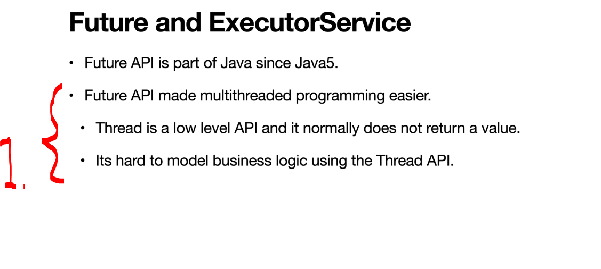
</div>

1. **Future API's** is to retrieve the result of an asynchronous task. This made it easier to return values from **Threads**!

<div align="center">
    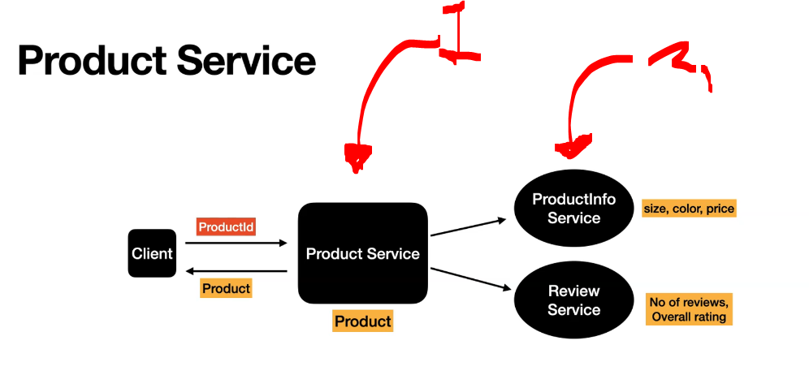
</div>

1. We will be having the **product service**!
2. It will have two **services** behind it!

> [!TIP]
> 💡 `ExecutorService` is a Java framework for managing and executing threads. Instead of creating and managing threads manually, you submit tasks to `ExecutorService`, which handles the threads for you. 💡
>    - Old way, with **Thread's APIS**:
>        ````Java
>        Thread t = new Thread(() -> {
>            System.out.println("Running...");
>        });
>        t.start();
>        
>        ````
>    - With **ExecutorService**:
>        ````Java
>        ExecutorService executor = Executors.newFixedThreadPool(2);
>        executor.submit(() -> {
>        System.out.println("Running...");
>        });
>        executor.shutdown();
>        ````

<div align="center">
    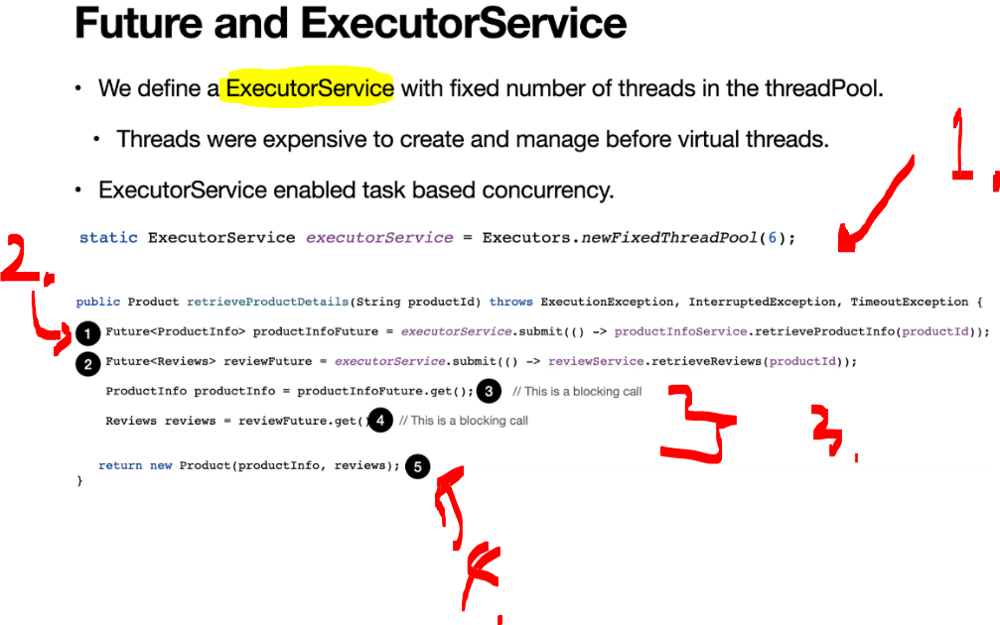
</div>

1. Create pool of **6 worker** threads.
2. **Future** is as a promise of a **result that will be available later**.
3. These are **blocking** calls!
4. Collect are return **Product**!

# ProductService using Future API and ExecutorService.

#### ProductServiceUsingExecutor.java

````Java
package com.modernjava.future;


import com.modernjava.domain.Product;
import com.modernjava.domain.ProductInfo;
import com.modernjava.domain.Reviews;
import com.modernjava.service.ProductInfoService;
import com.modernjava.service.ReviewService;
import com.modernjava.util.LoggerUtil;

import java.util.concurrent.*;

public class ProductServiceUsingExecutor {

    static ExecutorService executorService = Executors.newFixedThreadPool(6);

    private final ProductInfoService productInfoService;
    private final ReviewService reviewService;

    public ProductServiceUsingExecutor(ProductInfoService productInfoService, ReviewService reviewService) {
        this.productInfoService = productInfoService;
        this.reviewService = reviewService;
    }

    public Product retrieveProductDetails(String productId) throws ExecutionException, InterruptedException, TimeoutException {

        Future<ProductInfo> productInfoFuture = executorService.submit(() -> productInfoService.retrieveProductInfo(productId));
        Future<Reviews> reviewFuture = executorService.submit(() -> reviewService.retrieveReviews(productId));

        ProductInfo productInfo = productInfoFuture.get(); // This is a  blocking call.
        //ProductInfo productInfo = productInfoFuture.get(2, TimeUnit.SECONDS);
        Reviews reviews = reviewFuture.get(); // This is a  blocking call.
        //Review review = reviewFuture.get(2, TimeUnit.SECONDS);

        return new Product(productId, productInfo, reviews);
    }

    public static void main(String[] args) throws ExecutionException, InterruptedException, TimeoutException {

        ProductInfoService productInfoService = new ProductInfoService();
        ReviewService reviewService = new ReviewService();
        ProductServiceUsingExecutor productService = new ProductServiceUsingExecutor(productInfoService, reviewService);
        String productId = "ABC123";
        Product product = productService.retrieveProductDetails(productId);
        LoggerUtil.log("Product is " + product);
        executorService.shutdown();
    }
}
````

- These are executed as parallel!
    ````Java
    Future<ProductInfo> productInfoFuture = executorService.submit(() -> productInfoService.retrieveProductInfo(productId));
    Future<Reviews> reviewFuture = executorService.submit(() -> reviewService.retrieveReviews(productId));
    ````
- There are blocking calls, to get data!
    ````Java
    ProductInfo productInfo = productInfoFuture.get(); // This is a  blocking call.
    //ProductInfo productInfo = productInfoFuture.get(2, TimeUnit.SECONDS);
    Reviews reviews = reviewFuture.get(); // This is a  blocking call.
    ````

- We can see the **ExecutorService** is working! This is done with help of test!

````Java
package com.modernjava.future;


import com.modernjava.service.ProductInfoService;
import com.modernjava.service.ReviewService;
import org.junit.jupiter.api.Assertions;
import org.junit.jupiter.api.Test;
import org.junit.jupiter.api.extension.ExtendWith;
import org.mockito.InjectMocks;
import org.mockito.Spy;
import org.mockito.junit.jupiter.MockitoExtension;

import java.util.concurrent.ExecutionException;
import java.util.concurrent.TimeoutException;

import static org.junit.jupiter.api.Assertions.assertEquals;
import static org.junit.jupiter.api.Assertions.assertNotNull;
import static org.mockito.ArgumentMatchers.anyString;
import static org.mockito.Mockito.when;


@ExtendWith(MockitoExtension.class)
class ProductServiceUsingExecutorTest {

    @Spy
    ProductInfoService productInfoService;

    @Spy
    ReviewService reviewService;

    @InjectMocks
    ProductServiceUsingExecutor productServiceUsingExecutor;


    @Test
    void retrieveProductDetails() throws ExecutionException, InterruptedException, TimeoutException {
        var product = productServiceUsingExecutor.retrieveProductDetails("ABC");
        assertNotNull(product);
    }

    @Test
    void retrieveProductDetailsException() throws InterruptedException {
        when(productInfoService.retrieveProductInfo(anyString())).thenThrow(new RuntimeException("Exception Occurred"));
        var exception = Assertions.assertThrows(ExecutionException.class, () -> productServiceUsingExecutor.retrieveProductDetails("ABC"));
        assertEquals("java.lang.RuntimeException: Exception Occurred", exception.getMessage());

        Thread.sleep(2000);
    }
}
````

- Test running:

<div align="center">
    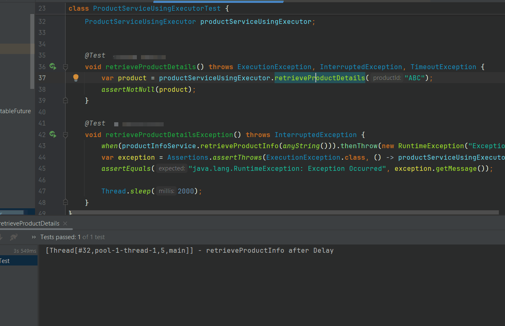
</div>

- Limitation of limitations of **ExecutorService** and **Future API**. 

<div align="center">
    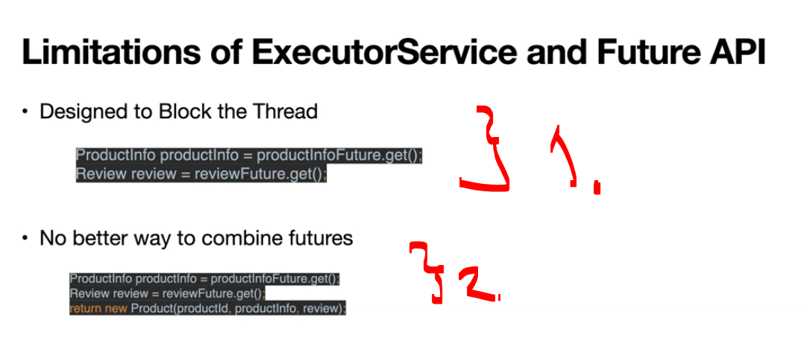
</div>

1. To get data, we need to call `.get()`. This is blocking task!
2. There is no better way to combine data!

<details>
<summary id="Code_Future_API_And_ExecutorService" open="true"> <b>Code for the Future API and ExecutorService!</b> </summary>
 
 #### ProductServiceUsingExecutor.java

````Java
package com.modernjava.future;

import com.modernjava.domain.Product;
import com.modernjava.domain.ProductInfo;
import com.modernjava.domain.Reviews;
import com.modernjava.service.ProductInfoService;
import com.modernjava.service.ReviewService;
import com.modernjava.util.LoggerUtil;

import java.util.concurrent.*;

public class ProductServiceUsingExecutor {

    static ExecutorService executorService = Executors.newFixedThreadPool(6);

    private final ProductInfoService productInfoService;
    private final ReviewService reviewService;

    public ProductServiceUsingExecutor(ProductInfoService productInfoService, ReviewService reviewService) {
        this.productInfoService = productInfoService;
        this.reviewService = reviewService;
    }

    public Product retrieveProductDetails(String productId) throws ExecutionException, InterruptedException, TimeoutException {

        Future<ProductInfo> productInfoFuture = executorService.submit(() -> productInfoService.retrieveProductInfo(productId));
        Future<Reviews> reviewFuture = executorService.submit(() -> reviewService.retrieveReviews(productId));

        ProductInfo productInfo = productInfoFuture.get(); // This is a  blocking call.
        //ProductInfo productInfo = productInfoFuture.get(2, TimeUnit.SECONDS);
        Reviews reviews = reviewFuture.get(); // This is a  blocking call.
        //Review review = reviewFuture.get(2, TimeUnit.SECONDS);

        return new Product(productId, productInfo, reviews);
    }

    public static void main(String[] args) throws ExecutionException, InterruptedException, TimeoutException {

        ProductInfoService productInfoService = new ProductInfoService();
        ReviewService reviewService = new ReviewService();
        ProductServiceUsingExecutor productService = new ProductServiceUsingExecutor(productInfoService, reviewService);
        String productId = "ABC123";
        Product product = productService.retrieveProductDetails(productId);
        LoggerUtil.log("Product is " + product);
        executorService.shutdown();
    }
}
````

#### ProductInfoService.java

````Java
package com.modernjava.service;


import com.modernjava.domain.ProductInfo;
import com.modernjava.domain.ProductOption;
import com.modernjava.util.CommonUtil;
import com.modernjava.util.LoggerUtil;

import java.io.IOException;
import java.net.http.HttpResponse;
import java.util.List;
import java.util.concurrent.StructuredTaskScope;

import static com.modernjava.util.CommonUtil.objectMapper;
import static com.modernjava.util.CommonUtil.requestBuilder;


public class ProductInfoService {

    //virtual-threads/src/main/resources/deliveryDetails.json
    public  static String PRODUCT_INFO_URL = "http://127.0.0.1:8000/virtual-threads/src/main/resources/productInfo.json";


    public ProductInfo retrieveProductInfoHttp(String productId) throws IOException, InterruptedException {
        var httpClient = CommonUtil.httpClient;
        var httpRequest = requestBuilder(PRODUCT_INFO_URL);

        HttpResponse<String> response =
                httpClient.send(httpRequest, HttpResponse.BodyHandlers.ofString());

        System.out.println("Status code: " + response.statusCode());
        return objectMapper.readValue(response.body(), ProductInfo.class);

    }

    public ProductInfo retrieveProductInfo(String productId) {
        CommonUtil.sleep(1000);
//        throw new RuntimeException("retrieveProductInfo");
        List<ProductOption> productOptions = List.of(new ProductOption("64GB", "Black", 699.99),
                new ProductOption("128GB", "Black", 749.99));
        LoggerUtil.log("retrieveProductInfo after Delay");
        return new ProductInfo(productId, productOptions);
    }


    public ProductInfo retrieveProductInfoV2(String productId) {
        CommonUtil.sleep(2000);
        List<ProductOption> productOptions = List.of(new ProductOption("64GB", "Black", 699.99),
                new ProductOption("128GB", "Black", 749.99));
        LoggerUtil.log("retrieveProductInfo after Delay v2 ");
        return new ProductInfo(productId, productOptions);
    }

    public ProductInfo retrieveProductInfoV3(String productId) {
        CommonUtil.sleep(8000);
        List<ProductOption> productOptions = List.of(new ProductOption("64GB", "Black", 699.99),
                new ProductOption("128GB", "Black", 749.99));
        LoggerUtil.log("retrieveProductInfo after Delay v3 ");
        return new ProductInfo(productId, productOptions);
    }

    public ProductInfo retrieveProductInfo_MultipleSources(String productId) {

        try (var scope = new StructuredTaskScope.ShutdownOnSuccess<ProductInfo>()) {
            scope.fork(() -> retrieveProductInfo(productId));
            scope.fork(() -> retrieveProductInfoV2(productId));
            scope.fork(() -> retrieveProductInfoV3(productId));

            return scope.join().result();
        } catch (Exception e) {
            throw new RuntimeException(e);
        }
    }
}
````

#### ProductServiceUsingExecutorTest.java

````Java
package com.modernjava.future;


import com.modernjava.service.ProductInfoService;
import com.modernjava.service.ReviewService;
import org.junit.jupiter.api.Assertions;
import org.junit.jupiter.api.Test;
import org.junit.jupiter.api.extension.ExtendWith;
import org.mockito.InjectMocks;
import org.mockito.Spy;
import org.mockito.junit.jupiter.MockitoExtension;

import java.util.concurrent.ExecutionException;
import java.util.concurrent.TimeoutException;

import static org.junit.jupiter.api.Assertions.assertEquals;
import static org.junit.jupiter.api.Assertions.assertNotNull;
import static org.mockito.ArgumentMatchers.anyString;
import static org.mockito.Mockito.when;

@ExtendWith(MockitoExtension.class)
class ProductServiceUsingExecutorTest {

    @Spy
    ProductInfoService productInfoService;

    @Spy
    ReviewService reviewService;

    @InjectMocks
    ProductServiceUsingExecutor productServiceUsingExecutor;

    @Test
    void retrieveProductDetails() throws ExecutionException, InterruptedException, TimeoutException {
        var product = productServiceUsingExecutor.retrieveProductDetails("ABC");
        assertNotNull(product);
    }

    @Test
    void retrieveProductDetailsException() throws InterruptedException {
        when(productInfoService.retrieveProductInfo(anyString())).thenThrow(new RuntimeException("Exception Occurred"));
        var exception = Assertions.assertThrows(ExecutionException.class, () -> productServiceUsingExecutor.retrieveProductDetails("ABC"));
        assertEquals("java.lang.RuntimeException: Exception Occurred", exception.getMessage());

        Thread.sleep(2000);
    }
}
````
</details>

# CompletableFuture API - ProductService using CompletableFuture API.

<div align="center">
    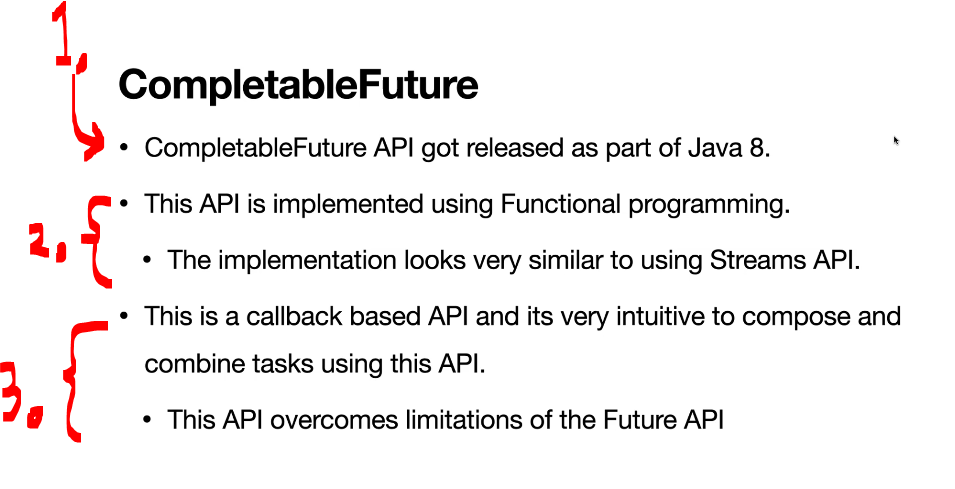
</div>

1. Used from **Java 8** onwards!
2. This can be used with **Functional Programming** style:
    ````Java
    CompletableFuture.supplyAsync(() -> getUser())
                 .thenApply(user -> user.getName())
                 .thenAccept(System.out::println);
    ````
3. This overcomes the **Future API** limitations!
    - A **callback-based API** is an API where you provide a function (callback) that is automatically executed when an asynchronous task finishes, instead of waiting for the result yourself.
        - In **Future API** one would need to wait:
            ````Java
            Future<String> future = executor.submit(() -> "Hello");
            // Wait here until the task finishes
            String result = future.get();
            ````
        - In **CompletableFuture API** one would need to provide **callback function**!
            ````Java
            CompletableFuture.supplyAsync(() -> "Hello")
                .thenAccept(result -> {
                    System.out.println(result);
                });
            ````

- The same `retrieveProductDetails(...)` function, but with **CompletableFuture API**!

````Java
public Product retrieveProductDetails(String productId) {
        //Calls are asynchronous
        CompletableFuture<ProductInfo> cfProductInfo = CompletableFuture.supplyAsync(() -> productInfoService.retrieveProductInfo(productId));
        CompletableFuture<Reviews> cfReview = CompletableFuture.supplyAsync(() -> reviewService.retrieveReviews(productId));

        //Functional and Call back based
        return CompletableFuture.allOf(cfProductInfo, cfReview)
                .thenApply(v -> {
                    return new Product(productId, cfProductInfo.join(), cfReview.join());
                })
                .join();
    }
````

- One can see there is no **ExecutorService** like in here:
    - `static ExecutorService executorService = Executors.newFixedThreadPool(6);`
        - We define the API calls:
            - `CompletableFuture<ProductInfo> cfProductInfo = CompletableFuture.supplyAsync(() -> productInfoService.retrieveProductInfo(productId));`!
            - `CompletableFuture<Reviews> cfReview = CompletableFuture.supplyAsync(() -> reviewService.retrieveReviews(productId));`!

- We will **wait** for **all API calls** to finish, then join the result!
    - `CompletableFuture.allOf()` is very similar to `Promise.all()` in **Angular/JavaScript**!
````Java
        //Functional and Call back based
        return CompletableFuture.allOf(cfProductInfo, cfReview)
                .thenApply(v -> {
                    return new Product(productId, cfProductInfo.join(), cfReview.join());
                })
                .join();
````

- We will be testing this:

````Java
package com.modernjava.completablefuture;

import com.modernjava.domain.Product;
import com.modernjava.service.ProductInfoService;
import com.modernjava.service.ReviewService;
import org.junit.jupiter.api.Assertions;
import org.junit.jupiter.api.Disabled;
import org.junit.jupiter.api.Test;
import org.junit.jupiter.api.extension.ExtendWith;
import org.mockito.InjectMocks;
import org.mockito.Spy;
import org.mockito.junit.jupiter.MockitoExtension;

import java.util.concurrent.CompletableFuture;
import java.util.concurrent.CompletionException;

import static org.junit.jupiter.api.Assertions.*;
import static org.mockito.ArgumentMatchers.anyString;
import static org.mockito.Mockito.when;

@ExtendWith(MockitoExtension.class)
class ProductServiceUsingCompletableFutureTest {

    @Spy
    ProductInfoService productInfoService;
    @Spy
    ReviewService reviewService;
    @InjectMocks
    ProductServiceUsingCompletableFuture productServiceUsingCF;

    @Test
    void retrieveProductDetails() {

        //given
        String productId = "ABC123";

        //when
        Product product = productServiceUsingCF.retrieveProductDetails(productId);

        //then
        assertNotNull(product);
        assertTrue(!product.productInfo().productOptions().isEmpty());
        assertNotNull(product.reviews());

    }
}
````

- We will be running the test:

<div align="center">
    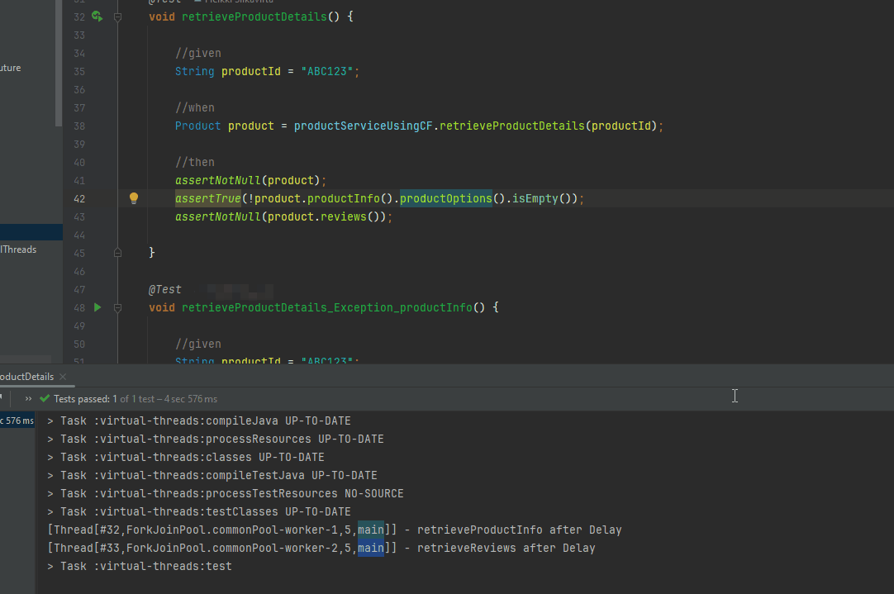
</div>

- We can see the logs:

````Bash
[Thread[#32,ForkJoinPool.commonPool-worker-1,5,main]] - retrieveProductInfo after Delay
[Thread[#33,ForkJoinPool.commonPool-worker-2,5,main]] - retrieveReviews after Delay
````

<div align="center">
    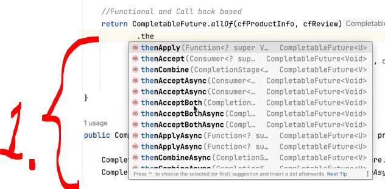
</div>

1. There are multiple operations in the `CompatableFuture`, we will not go thought them all here! 

<details>
<summary id="Code_CompletableFuture" open="true"> <b>Code for the CompletableFuture!</b> </summary>
 
 #### ProductServiceUsingCompletableFuture.java

````Java
package com.modernjava.completablefuture;


import com.modernjava.domain.Product;
import com.modernjava.domain.ProductInfo;
import com.modernjava.domain.Reviews;
import com.modernjava.service.ProductInfoService;
import com.modernjava.service.ReviewService;
import com.modernjava.util.LoggerUtil;

import java.util.concurrent.CompletableFuture;

public class ProductServiceUsingCompletableFuture {
    private final ProductInfoService productInfoService;
    private final ReviewService reviewService;

    public ProductServiceUsingCompletableFuture(ProductInfoService productInfoService, ReviewService reviewService) {
        this.productInfoService = productInfoService;
        this.reviewService = reviewService;
    }

    public Product retrieveProductDetails(String productId) {

        //Calls are asynchronous
        CompletableFuture<ProductInfo> cfProductInfo = CompletableFuture.supplyAsync(() -> productInfoService.retrieveProductInfo(productId));
        CompletableFuture<Reviews> cfReview = CompletableFuture.supplyAsync(() -> reviewService.retrieveReviews(productId));

        //Functional and Call back based
        return CompletableFuture.allOf(cfProductInfo, cfReview)
                .thenApply(v -> {
                    return new Product(productId, cfProductInfo.join(), cfReview.join());
                })
                .join();
    }

    public CompletableFuture<Product> retrieveProductDetails_CF(String productId) {

        CompletableFuture<ProductInfo> cfProductInfo = CompletableFuture.supplyAsync(() -> productInfoService.retrieveProductInfo(productId));
        CompletableFuture<Reviews> cfReview = CompletableFuture.supplyAsync(() -> reviewService.retrieveReviews(productId));

        return cfProductInfo
                .thenCombine(cfReview, (productInfo, review) -> new Product(productId, productInfo, review));
    }

    public Product retrieveProductDetails_exceptionhandling(String productId) {
        CompletableFuture<ProductInfo> cfProductInfo = CompletableFuture.supplyAsync(() -> productInfoService.retrieveProductInfo(productId));
        CompletableFuture<Reviews> cfReview = CompletableFuture.supplyAsync(() -> reviewService.retrieveReviews(productId));

        return CompletableFuture.allOf(cfProductInfo, cfReview)
//                .whenComplete((unused, throwable) -> {
//                    if (throwable != null) {
//                        LoggerUtil.log("Exception Occurred in the business logic " + throwable.getMessage());
//                        throw new RuntimeException(throwable.getMessage());
//                    }
//                })
                .exceptionally(throwable -> {
                    LoggerUtil.log("Exception Occurred in the business logic " + throwable.getMessage());
                    throw new RuntimeException(throwable);
                })
                .thenApply(v -> new Product(productId, cfProductInfo.join(), cfReview.join()))
                .join();
    }

    public static void main(String[] args) {

        ProductInfoService productInfoService = new ProductInfoService();
        ReviewService reviewService = new ReviewService();
        ProductServiceUsingCompletableFuture productService = new ProductServiceUsingCompletableFuture(productInfoService, reviewService);
        String productId = "ABC123";
        Product product = productService.retrieveProductDetails(productId);
        LoggerUtil.log("Product is " + product);

    }
}
````
</details>

