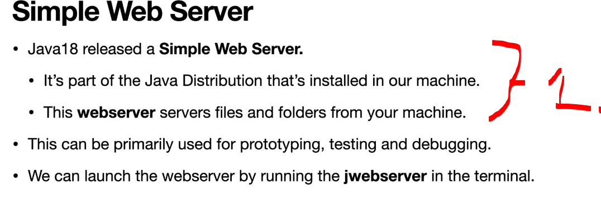
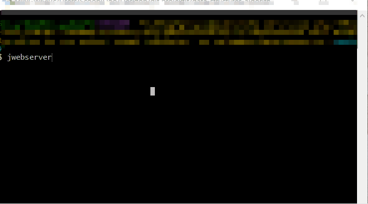
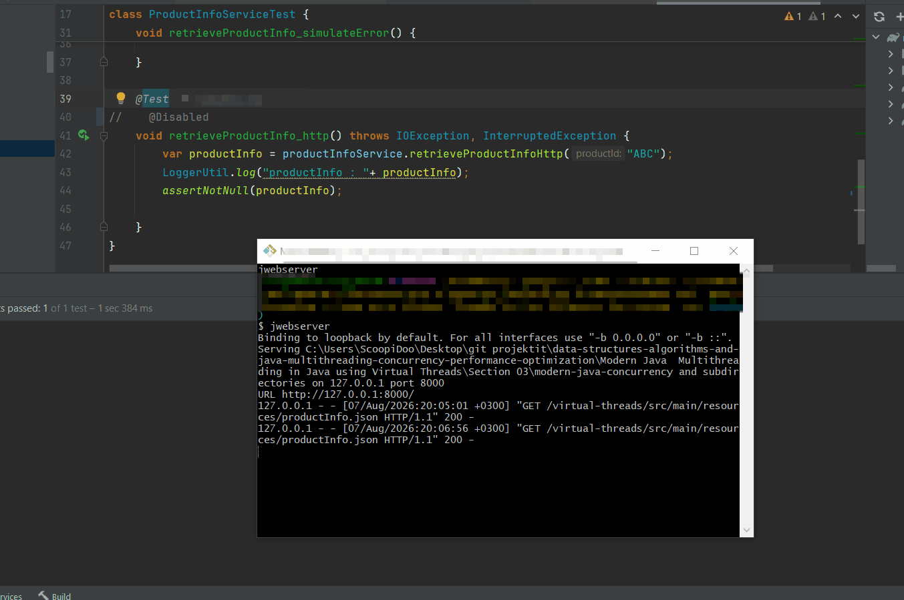
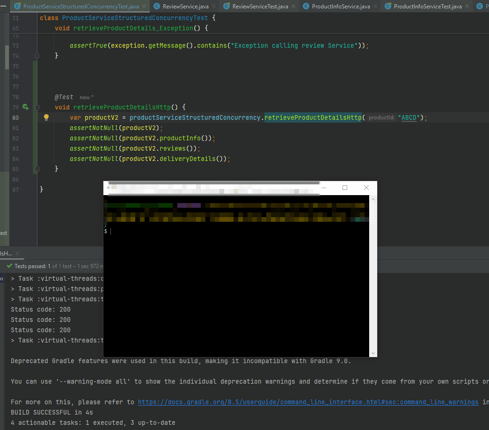

# Chapter 07 - HTTP calls using Virtual Threads.

HTTP calls using Virtual Threads.

# What I learned.

# Set Up Simple WebServer.

<div align="center">
    
</div>

1. This is **Simple Web Server** from **Java 18**
    - This will be serving files from **local machine**!

> [!TIP]
> 💡 `jwebserver` is a lightweight HTTP server included with the JDK starting in Java 18. It's designed for prototyping, testing, and serving static files, not for production web applications. It only supports HTTP/1.1 and serves static content (HTML, CSS, JavaScript, images, etc.). 💡

- We will be making **Simple Web Server** to return the **JSON**.
  - The project folder `modern-java-concurrency`, where we will be running the `jwebserver` in this folder.
  <div align="center">
        
    </div>

    - We will start the server running with the `jwebserver`.
    
    <div align="center">
        
    </div>
    1. We will be returning this:

````JSON
{
  "productId": 1234,
  "productOptions": [{
    "size": "64GB",
    "color": "black",
    "price": 699.99
  },
    {
      "size": "512GB",
      "color": "black",
      "price": 999.99
    }
  ]
}
````

- We can test endpoint was with **Simple Web Server**!

# Build the HttpClient for ProductInfo service.

- **Java** and **Spring** provides some popular **HTTP web client** options:

| Client                         | Built-in?   | Best for                                             |
| ------------------------------ | ----------- | ---------------------------------------------------- |
| **HttpClient** (`java.net.http`) | ✅ Java 11+  | **General-purpose HTTP client (recommended)**!            |
| `HttpURLConnection`            | ✅ Java 1.1+ | Legacy applications.                                  |
| Spring WebClient               | ❌           | Reactive Spring applications.                         |
| Spring RestClient              | ❌           | Modern synchronous Spring applications (Spring 6.1+). |
| Spring RestTemplate            | ❌           | Older Spring applications (maintenance mode).         |

- We will have the following **utils** class for the **HttpClient** creation.

````Java
package com.modernjava.util;

import com.fasterxml.jackson.databind.ObjectMapper;
import com.fasterxml.jackson.databind.SerializationFeature;
import com.fasterxml.jackson.datatype.jsr310.JavaTimeModule;

import java.net.URI;
import java.net.http.HttpClient;
import java.net.http.HttpRequest;
import java.time.Duration;

import static com.modernjava.util.LoggerUtil.log;
import static java.net.http.HttpRequest.newBuilder;

public class CommonUtil {

    public static final HttpClient httpClient = HttpClient.newBuilder()
            .connectTimeout(Duration.ofSeconds(2))
            .build();

    public  static final ObjectMapper objectMapper = new ObjectMapper()
            .registerModule(new JavaTimeModule())
            .configure(SerializationFeature.WRITE_DATES_AS_TIMESTAMPS, false);

    public static HttpRequest requestBuilder(String url) {
        return newBuilder()
                .uri(URI.create(url))
                .header("Accept", "application/json")
                .GET() // default (could leave that out)
                .build();
    }
}
````

- We will be creating **HTTP Client call** to our **Simple Web Server**!
  - We will make **HTTP client**:
    ````Java
      var httpClient = CommonUtil.httpClient;
      var httpRequest = requestBuilder(PRODUCT_INFO_URL);
    ````
  - In here we will be making **HTTP client request**.
    ````Java
            HttpResponse<String> response =
                    httpClient.send(httpRequest, HttpResponse.BodyHandlers.ofString());
    ````
      - The **handler** for the response!
        - `HttpResponse.BodyHandlers.ofString()`.
          - *"Read the HTTP response body and give it to me as a String."*
      - The request to send **httpRequest**.
  - Converts the **JSON** to the **ProductInfo** java object.
    - `return objectMapper.readValue(response.body(), ProductInfo.class);`.

- We can test this client and server!
  ````Java
      @Test
      @Disabled
      void retrieveProductInfo_http() throws IOException, InterruptedException {
          var productInfo = productInfoService.retrieveProductInfoHttp("ABC");
          LoggerUtil.log("productInfo : "+ productInfo);
          assertNotNull(productInfo);

      }
  ````

- We will be testing this with the previous test: 

<div align="center">
    
</div>

<details>
<summary id="Code_CompletableFuture" open="true"> <b>Code for the Simple WebServer, with test!</b> </summary>
 
#### ProductInfoServiceTest.java

````Java

package com.modernjava.service;

import com.modernjava.util.LoggerUtil;
import org.junit.jupiter.api.Disabled;
import org.junit.jupiter.api.Test;
import org.junit.jupiter.api.extension.ExtendWith;
import org.mockito.Spy;
import org.mockito.junit.jupiter.MockitoExtension;

import java.io.IOException;

import static org.junit.jupiter.api.Assertions.assertNotNull;
import static org.mockito.ArgumentMatchers.anyString;
import static org.mockito.Mockito.when;

@ExtendWith(MockitoExtension.class)
class ProductInfoSercviceTest {

    @Spy
    ProductInfoService productInfoService = new ProductInfoService();

    @Test
//    @Disabled
    void retrieveProductInfo_http() throws IOException, InterruptedException {
        var productInfo = productInfoService.retrieveProductInfoHttp("ABC");
        LoggerUtil.log("productInfo : "+ productInfo);
        assertNotNull(productInfo);

    }
}
````

#### ProductInfoService.java

````Java
package com.modernjava.service;

import com.modernjava.domain.ProductInfo;
import com.modernjava.domain.ProductOption;
import com.modernjava.util.CommonUtil;
import com.modernjava.util.LoggerUtil;

import java.io.IOException;
import java.net.http.HttpResponse;
import java.util.List;
import java.util.concurrent.StructuredTaskScope;

import static com.modernjava.util.CommonUtil.objectMapper;
import static com.modernjava.util.CommonUtil.requestBuilder;


public class ProductInfoService {

    // virtual-threads/src/main/resources/deliveryDetails.json
    public  static String PRODUCT_INFO_URL = "http://127.0.0.1:8000/virtual-threads/src/main/resources/productInfo.json";


    public ProductInfo retrieveProductInfoHttp(String productId) throws IOException, InterruptedException {
        var httpClient = CommonUtil.httpClient;
        var httpRequest = requestBuilder(PRODUCT_INFO_URL);

        HttpResponse<String> response =
                httpClient.send(httpRequest, HttpResponse.BodyHandlers.ofString());

        System.out.println("Status code: " + response.statusCode());
        return objectMapper.readValue(response.body(), ProductInfo.class);

    }

    public ProductInfo retrieveProductInfo(String productId) {
        CommonUtil.sleep(1000);
//        throw new RuntimeException("retrieveProductInfo");
        List<ProductOption> productOptions = List.of(new ProductOption("64GB", "Black", 699.99),
                new ProductOption("128GB", "Black", 749.99));
        LoggerUtil.log("retrieveProductInfo after Delay");
        return new ProductInfo(productId, productOptions);
    }

    public ProductInfo retrieveProductInfoV2(String productId) {
        CommonUtil.sleep(2000);
        List<ProductOption> productOptions = List.of(new ProductOption("64GB", "Black", 699.99),
                new ProductOption("128GB", "Black", 749.99));
        LoggerUtil.log("retrieveProductInfo after Delay v2 ");
        return new ProductInfo(productId, productOptions);
    }

    public ProductInfo retrieveProductInfoV3(String productId) {
        CommonUtil.sleep(8000);
        List<ProductOption> productOptions = List.of(new ProductOption("64GB", "Black", 699.99),
                new ProductOption("128GB", "Black", 749.99));
        LoggerUtil.log("retrieveProductInfo after Delay v3 ");
        return new ProductInfo(productId, productOptions);
    }

    public ProductInfo retrieveProductInfo_MultipleSources(String productId) {

        try (var scope = new StructuredTaskScope.ShutdownOnSuccess<ProductInfo>()) {
            scope.fork(() -> retrieveProductInfo(productId));
            scope.fork(() -> retrieveProductInfoV2(productId));
            scope.fork(() -> retrieveProductInfoV3(productId));

            return scope.join().result();
        } catch (Exception e) {
            throw new RuntimeException(e);
        }
    }
}
````

</details>


# Lets make real HTTP calls in ProductService using VirtualThreads.


- Test case with the HTTP calls!

````Java
    @Test
    void retrieveProductDetailsHttp() {
        var productV2 = productServiceStructuredConcurrency.retrieveProductDetailsHttp("ABCD");
        assertNotNull(productV2);
        assertNotNull(productV2.productInfo());
        assertNotNull(productV2.reviews());
        assertNotNull(productV2.deliveryDetails());
    }
````

- Method for making `retrieveProductDetailsHttp` calls!

````Java
public ProductV2 retrieveProductDetailsHttp(String productId) {

        // We will implement this using Structured Concurrency!
        try (var scope = new StructuredTaskScope.ShutdownOnFailure())
        {
            // Fork the task. Where we make a calls!
            var productsInfoSubTask = scope.fork(() -> productInfoService.retrieveProductInfoHttp(productId));
            var reviewsSubTask = scope.fork(() -> reviewService.retrieveReviewsHttp(productId));

            // Join the tasks. We will wait for the task to finish!
            scope.join().throwIfFailed();

            var productInfo = productsInfoSubTask.get();
            var reviewsInfo = reviewsSubTask.get();

            // We are getting DeliveryDetails.
            var deliveryDetailsTask = scope.fork(() -> deliveryService.retrieveDeliveryInfoHttp(productInfo));
            scope.join().throwIfFailed();

            return new ProductV2(productId, productInfo, reviewsInfo, deliveryDetailsTask.get());

        } catch (Exception e) {
            throw new RuntimeException(e);
        }
    }
````


<div align="center">
    
</div>

- We can see the real HTTP calls is being made!


<details>
<summary id="Code_CompletableFuture" open="true"> <b>Code for the Simple WebServer, with test!</b> </summary>
 
#### ProductServiceStructuredConcurrency.java

````Java
package com.modernjava.structuredconcurrency;


import com.modernjava.domain.Product;
import com.modernjava.domain.ProductV2;
import com.modernjava.service.DeliveryService;
import com.modernjava.service.ProductInfoService;
import com.modernjava.service.ReviewService;

import java.util.concurrent.StructuredTaskScope;


public class ProductServiceStructuredConcurrency {

    private final ProductInfoService productInfoService;
    private final ReviewService reviewService;
    private final DeliveryService deliveryService;

    public ProductServiceStructuredConcurrency(ProductInfoService productInfoService, ReviewService reviewService, DeliveryService deliveryService) {
        this.productInfoService = productInfoService;
        this.reviewService = reviewService;
        this.deliveryService = deliveryService;
    }

    public ProductServiceStructuredConcurrency(ProductInfoService productInfoService, ReviewService reviewService) {
        this.productInfoService = productInfoService;
        this.reviewService = reviewService;
        this.deliveryService = null;
    }


    public Product retrieveProductDetails(String productId) {
        // We will implement this using Structured Concurrency!

        try (var scope = new StructuredTaskScope.ShutdownOnFailure())
        {
            // Fork the task. Where we make a calls!
            var productsInfoSubTask = scope.fork(() -> productInfoService.retrieveProductInfo(productId));
            var reviewsSubTask = scope.fork(() -> reviewService.retrieveReviews(productId));

            // Join the tasks. We will wait for the task to finish!
            scope.join().throwIfFailed();

            var productInfo = productsInfoSubTask.get();
            var reviewsInfo = reviewsSubTask.get();

            return  new Product(productId, productInfo, reviewsInfo);

        } catch (Exception e) {
            throw new RuntimeException(e);
        }
    }

    public ProductV2 retrieveProductDetailsV2(String productId) {

        // We will implement this using Structured Concurrency!
        try (var scope = new StructuredTaskScope.ShutdownOnFailure())
        {
            // Fork the task. Where we make a calls!
            var productsInfoSubTask = scope.fork(() -> productInfoService.retrieveProductInfo(productId));
            var reviewsSubTask = scope.fork(() -> reviewService.retrieveReviews(productId));

            // Join the tasks. We will wait for the task to finish!
            scope.join().throwIfFailed();

            var productInfo = productsInfoSubTask.get();
            var reviewsInfo = reviewsSubTask.get();

            // We are getting DeliveryDetails.
            var deliveryDetailsTask = scope.fork(() -> deliveryService.retrieveDeliveryInfo(productInfo));
            scope.join().throwIfFailed();

            return new ProductV2(productId, productInfo, reviewsInfo, deliveryDetailsTask.get());

        } catch (Exception e) {
            throw new RuntimeException(e);
        }
    }

    public ProductV2 retrieveProductDetailsHttp(String productId) {

        // We will implement this using Structured Concurrency!
        try (var scope = new StructuredTaskScope.ShutdownOnFailure())
        {
            // Fork the task. Where we make a calls!
            var productsInfoSubTask = scope.fork(() -> productInfoService.retrieveProductInfoHttp(productId));
            var reviewsSubTask = scope.fork(() -> reviewService.retrieveReviewsHttp(productId));

            // Join the tasks. We will wait for the task to finish!
            scope.join().throwIfFailed();

            var productInfo = productsInfoSubTask.get();
            var reviewsInfo = reviewsSubTask.get();

            // We are getting DeliveryDetails.
            var deliveryDetailsTask = scope.fork(() -> deliveryService.retrieveDeliveryInfoHttp(productInfo));
            scope.join().throwIfFailed();

            return new ProductV2(productId, productInfo, reviewsInfo, deliveryDetailsTask.get());

        } catch (Exception e) {
            throw new RuntimeException(e);
        }
    }
}
````

#### ProductServiceStructuredConcurrencyTest.java

````Java
package com.modernjava.structuredconcurrency;

import com.modernjava.service.DeliveryService;
import com.modernjava.service.ProductInfoService;
import com.modernjava.service.ReviewService;
import org.junit.jupiter.api.Assertions;
import org.junit.jupiter.api.Disabled;
import org.junit.jupiter.api.Test;
import org.junit.jupiter.api.extension.ExtendWith;
import org.mockito.InjectMocks;
import org.mockito.Mock;
import org.mockito.Spy;
import org.mockito.junit.jupiter.MockitoExtension;

import static com.modernjava.util.LoggerUtil.log;
import static org.junit.jupiter.api.Assertions.*;
import static org.mockito.ArgumentMatchers.anyString;
import static org.mockito.Mockito.when;

@ExtendWith(MockitoExtension.class)
class ProductServiceStructuredConcurrencyTest {

    /*
    Written approach!
    ProductInfoService productInfoService = Mockito.spy(ProductInfoService.class);
    ReviewService reviewService = Mockito.spy(ReviewService.class);
     DeliveryService deliveryService = Mockito.spy(DeliveryService.class);

    ProductServiceStructuredConcurrency productServiceStructuredConcurrency
            = new ProductServiceStructuredConcurrency(productInfoService, reviewService, deliveryService);
    */

    // Annotation approach!
    @Spy
    ProductInfoService productInfoService;

    @Spy
    ReviewService reviewService;

    @Spy
    DeliveryService deliveryService;

    @InjectMocks
    ProductServiceStructuredConcurrency productServiceStructuredConcurrency;

    @Test
    void retrieveProductDetails() {
        var product = productServiceStructuredConcurrency.retrieveProductDetails("ABCD");
        assertNotNull(product);
        assertNotNull(product.productInfo());
        assertNotNull(product.reviews());
    }

    @Test
    void retrieveProductDetailsV2() {
        var productV2 = productServiceStructuredConcurrency.retrieveProductDetailsV2("ABCD");
        assertNotNull(productV2);
        assertNotNull(productV2.productInfo());
        assertNotNull(productV2.reviews());
        assertNotNull(productV2.deliveryDetails());
    }

    @Test
    void retrieveProductDetails_Exception() {

        when(reviewService.retrieveReviews(anyString()))
                .thenThrow(new RuntimeException("Exception calling review Service"));

        var exception = Assertions.assertThrows(RuntimeException.class,
                () -> productServiceStructuredConcurrency.retrieveProductDetails("ABC"));

        assertTrue(exception.getMessage().contains("Exception calling review Service"));
    }

    @Test
    void retrieveProductDetailsHttp() {
        var productV2 = productServiceStructuredConcurrency.retrieveProductDetailsHttp("ABCD");
        assertNotNull(productV2);
        assertNotNull(productV2.productInfo());
        assertNotNull(productV2.reviews());
        assertNotNull(productV2.deliveryDetails());
    }

}
````

</details>
