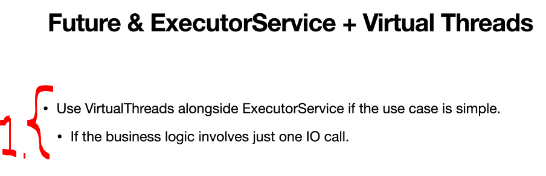
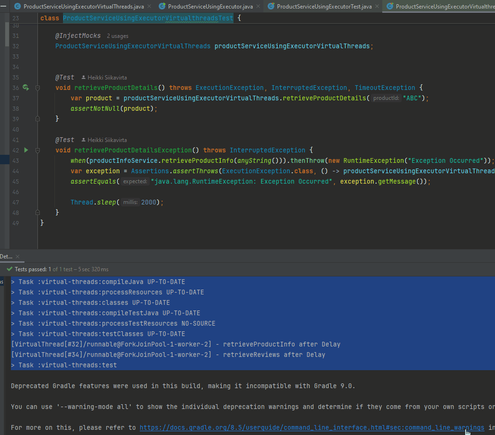

# Chapter 08 - Using Futures with Virtual Threads.

Using Futures with Virtual Threads.

# What I learned.

# Virtual Threads + Future & ExecutorService.

<div align="center">
    
</div>

1. We can use **Future and ExecutorService**, with the **Virtual Threads**
    - We can use this approach, if the business case is **really simple**!

````Java
package com.modernjava.future;


import com.modernjava.domain.Product;
import com.modernjava.domain.ProductInfo;
import com.modernjava.domain.Reviews;
import com.modernjava.service.ProductInfoService;
import com.modernjava.service.ReviewService;

import java.util.concurrent.*;

public class ProductServiceUsingExecutorVirtualThreads {

    static ExecutorService executorService = Executors.newVirtualThreadPerTaskExecutor();

    private final ProductInfoService productInfoService;
    private final ReviewService reviewService;

    public ProductServiceUsingExecutorVirtualThreads(ProductInfoService productInfoService, ReviewService reviewService) {
        this.productInfoService = productInfoService;
        this.reviewService = reviewService;
    }

    public Product retrieveProductDetails(String productId) throws ExecutionException, InterruptedException, TimeoutException {

        Future<ProductInfo> productInfoFuture = executorService.submit(() -> productInfoService.retrieveProductInfo(productId));
        Future<Reviews> reviewFuture = executorService.submit(() -> reviewService.retrieveReviews(productId));

        ProductInfo productInfo = productInfoFuture.get(); // This is a  blocking call.
        //ProductInfo productInfo = productInfoFuture.get(2, TimeUnit.SECONDS);
        Reviews reviews = reviewFuture.get(); // This is a  blocking call.
        //Review review = reviewFuture.get(2, TimeUnit.SECONDS);

        return new Product(productId, productInfo, reviews);
    }
}
````

- We will be changing the `static ExecutorService executorService = Executors.newFixedThreadPool(6);` to the `static ExecutorService executorService = Executors.newVirtualThreadPerTaskExecutor();`!
    - We will get use **Virtual Threads** instead of **Platform Threads**!

- The test for the **Virtual Threads** + **Future & ExecutorService**!

````Java
package com.modernjava.future;


import com.modernjava.domain.Product;
import com.modernjava.domain.ProductInfo;
import com.modernjava.domain.Reviews;
import com.modernjava.service.ProductInfoService;
import com.modernjava.service.ReviewService;

import java.util.concurrent.*;

public class ProductServiceUsingExecutorVirtualThreads {

    static ExecutorService executorService = Executors.newVirtualThreadPerTaskExecutor();

    private final ProductInfoService productInfoService;
    private final ReviewService reviewService;

    public ProductServiceUsingExecutorVirtualThreads(ProductInfoService productInfoService, ReviewService reviewService) {
        this.productInfoService = productInfoService;
        this.reviewService = reviewService;
    }

    public Product retrieveProductDetails(String productId) throws ExecutionException, InterruptedException, TimeoutException {

        Future<ProductInfo> productInfoFuture = executorService.submit(() -> productInfoService.retrieveProductInfo(productId));
        Future<Reviews> reviewFuture = executorService.submit(() -> reviewService.retrieveReviews(productId));

        ProductInfo productInfo = productInfoFuture.get(); // This is a  blocking call.
        //ProductInfo productInfo = productInfoFuture.get(2, TimeUnit.SECONDS);
        Reviews reviews = reviewFuture.get(); // This is a  blocking call.
        //Review review = reviewFuture.get(2, TimeUnit.SECONDS);

        return new Product(productId, productInfo, reviews);
    }
}
````

- Lets run the test:

<div align="center">
    
</div>

- We can see the **Virtual Threads**!