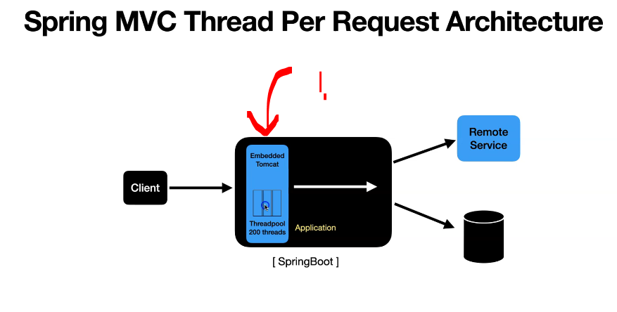
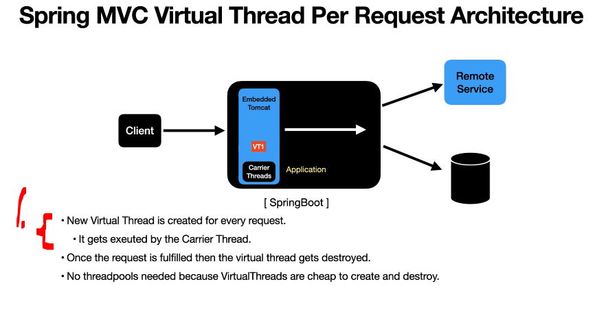
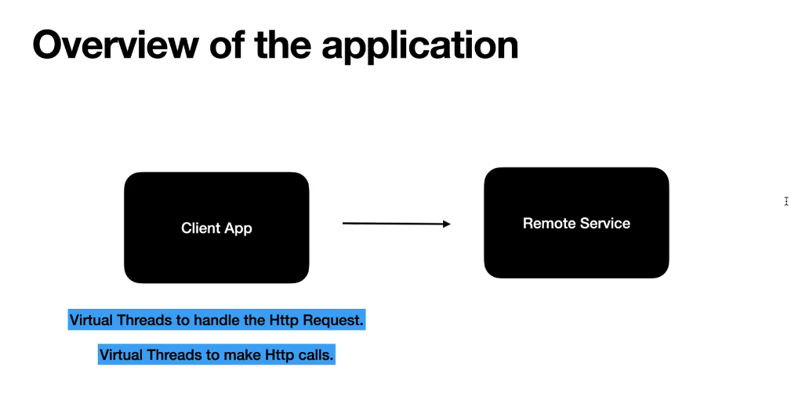

# Chapter 09 - Build a Spring Boot Application using Virtual Threads.

Build a Spring Boot Application using Virtual Threads.

# What I learned.

# Using Virtual Threads with SpringBoot App.

<div align="center">
    
</div>

1. There is assigned **thread** from **thread pool**! This is for normal **platform thread**!

<div align="center">
    
</div>

1. **Virtual Thread** is made per **every request**!

# Setup the Remote Service and Client Application.

<div align="center">
    
</div>

- There two Spring boot app!
    - `clientbootapp-virtual-threads`!  Client app!
    - `remote-service`! Server app!

# Configure the springboot app to use VirtualThreads.


- We are just playing with the:
    - [remote-service](https://github.com/developersCradle/data-structures-algorithms-and-java-multithreading-concurrency-performance-optimization/tree/main/Modern%20Java%20%20Multithreading%20in%20Java%20using%20Virtual%20Threads/Section%2003/modern-java-concurrency/virtual-threads) !
    - [virtual-threads](https://github.com/developersCradle/data-structures-algorithms-and-java-multithreading-concurrency-performance-optimization/tree/main/Modern%20Java%20%20Multithreading%20in%20Java%20using%20Virtual%20Threads/Section%2003/modern-java-concurrency/remote-service)!

<details>
<summary id="Code_Clientbootapp_Virtual_Threads" open="true"> <b>Code for the clientbootapp-virtual-threads!</b> </summary>
 
#### RemoteServiceClient.java

````Java
package com.virtualthreads.client;


import org.slf4j.Logger;
import org.slf4j.LoggerFactory;
import org.springframework.stereotype.Component;
import org.springframework.web.client.RestClient;

@Component
public class RemoteServiceClient {

    private final RestClient restClient;

    public RemoteServiceClient(RestClient.Builder builder) {
        this.restClient = builder.build();
    }

    private static final Logger log = LoggerFactory.getLogger(RemoteServiceClient.class);

    public String invokeBlockingService(Integer seconds) {
        log.info("Current Executing thread : {} ", Thread.currentThread());

        var response = restClient
                .get()
                .uri("http://localhost:8085/remote/"+seconds)
                .retrieve()
                .toEntity(String.class);
        log.info("response status code : {} , and the thread is : {} ", response.getStatusCode() , Thread.currentThread());
        return  response.getBody();

    }
}
````

#### BlockingController.java

````Java
package com.virtualthreads.controller;


import com.virtualthreads.client.RemoteServiceClient;
import org.slf4j.Logger;
import org.slf4j.LoggerFactory;
import org.springframework.http.ResponseEntity;
import org.springframework.web.bind.annotation.GetMapping;
import org.springframework.web.bind.annotation.PathVariable;
import org.springframework.web.bind.annotation.RestController;

@RestController
public class BlockingController {
    private static final Logger log = LoggerFactory.getLogger(RemoteServiceClient.class);

    private final RemoteServiceClient remoteServiceClient;

    public BlockingController(RemoteServiceClient remoteServiceClient) {
        this.remoteServiceClient = remoteServiceClient;
    }

    @GetMapping("/blocking/{seconds}")
    public  ResponseEntity<String> block(@PathVariable("seconds") Integer seconds){
        log.info("Received the request with seconds : {}", seconds);
        return ResponseEntity.ok(remoteServiceClient.invokeBlockingService(seconds));

    }

    @GetMapping("/currentThread")
    public String currentThread(){
        return Thread.currentThread().toString();
    }


}
````

#### ClientBootVirtualThreadsApp.java

````Java
package com.virtualthreads;

import org.slf4j.Logger;
import org.slf4j.LoggerFactory;
import org.springframework.beans.factory.annotation.Value;
import org.springframework.boot.SpringApplication;
import org.springframework.boot.autoconfigure.SpringBootApplication;
import org.springframework.boot.context.event.ApplicationReadyEvent;
import org.springframework.context.event.EventListener;

@SpringBootApplication
public class ClientBootVirtualThreadsApp {
    private static final Logger log = LoggerFactory.getLogger(ClientBootVirtualThreadsApp.class);

    @Value("${spring.threads.virtual.enabled:false}")
    private boolean virtualThreadFlag;

    public static void main(String[] args) {
        SpringApplication.run(ClientBootVirtualThreadsApp.class, args);
        log.info("availableProcessors = {} ", Runtime.getRuntime().availableProcessors());


    }

    @EventListener(ApplicationReadyEvent.class)
    public void doSomethingAfterStartup() {
        log.info("virtualThreadFlag : {} ", virtualThreadFlag);
        if (virtualThreadFlag) {
            log.info("Started the Client App in Tomcat virtual thread mode !");
        } else {
            log.info("Started the Client App in Tomcat thread pool mode !");
        }
    }
}
````

#### application.yml.java

````Yml
server:
  tomcat:
    threads:
      max: 10
#spring:
#  threads:
#    virtual:
#      enabled: true
````

</details>
