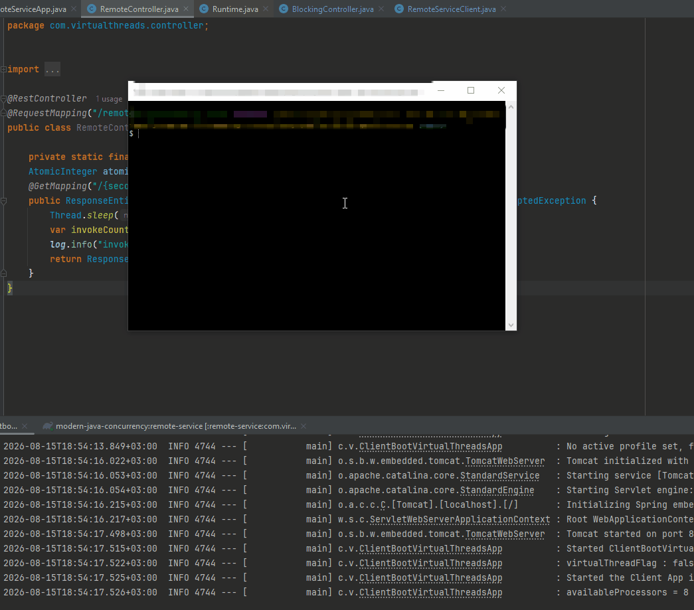
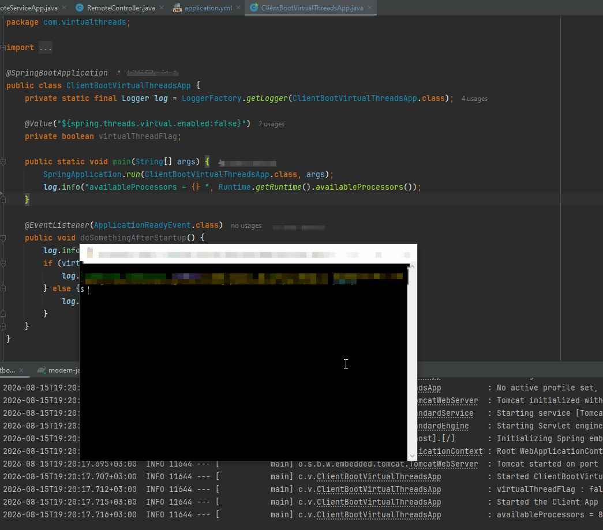

# Chapter 10 - Load Test using `ab` – Apache HTTP server benchmarking tool.

Load Test using `ab` – Apache HTTP server benchmarking tool.

# What I learned.

# Set up and run benchMarking using ab.

- We are using the project `clientbootapp-virtual-threads` [link](https://github.com/developersCradle/data-structures-algorithms-and-java-multithreading-concurrency-performance-optimization/tree/main/Modern%20Java%20%20Multithreading%20in%20Java%20using%20Virtual%20Threads/Section%2003/modern-java-concurrency/clientbootapp-virtual-threads)!

- Install [ab - Apache HTTP server benchmark tool link](https://github.com/dilipsundarraj1/modern-java-concurrency?tab=readme-ov-file#benchmarking-with-ab---apache-http-server-benchmarking-tool)!

# Load Test - VirtualThreads Spring MVC vs Traditional Spring MVC.

- Without **virtual threads**!
    ````Yml
    server:
    port: 8081
    tomcat:
        threads:
        max: 10
    #spring:
    #  threads:
    #    virtual:
    #      enabled: true
    ````

- Let's make benchmark `ab -n 10 -c 10  http://localhost:8080/blocking/2`.
    - `-n 10` → **10 requests total**!
    - `-c 10` → **10 requests at the same time**!

<div align="center">
    
</div>

- We get following log:

````Bash
$ ab -n 10 -c 10  http://localhost:8080/blocking/2
This is ApacheBench, Version 2.3 <$Revision: 1934973 $>
Copyright 1996 Adam Twiss, Zeus Technology Ltd, http://www.zeustech.net/
Licensed to The Apache Software Foundation, http://www.apache.org/

Benchmarking localhost (be patient).....done

Server Software:
Server Hostname:        localhost
Server Port:            8080

Document Path:          /blocking/2
Document Length:        28 bytes

Concurrency Level:      10
Time taken for tests:   4.056 seconds
Complete requests:      10
Failed requests:        0
Total transferred:      1610 bytes
HTML transferred:       280 bytes
Requests per second:    2.34 [#/sec] (mean)
Time per request:       4267.269 [ms] (mean)
Time per request:       426.727 [ms] (mean, across all concurrent requests)
Transfer rate:          0.37 [Kbytes/sec] received

Connection Times (ms)
              min  mean[+/-sd] median   max
Connect:        0    0   0.4      0       1
Processing:  2025 2049  66.0   2028    2236
Waiting:     2025 2048  65.1   2028    2233
Total:       2026 2049  65.9   2028    2236

Percentage of the requests served within a certain time (ms)
  50%   2028
  66%   2029
  75%   2030
  80%   2031
  90%   2236
  95%   2236
  98%   2236
  99%   2236
 100%   2236 (longest request)
````

- As we can see the request took: `Time taken for tests:   4.056 seconds`!

- Let's make benchmark `ab -n 20 -c 10  http://localhost:8080/blocking/2`.
    - 20 **total requests**.
    - 10 **concurrent requests at a time**.

<div align="center">
    
</div>

- We get following log:

````Bash
$ ab -n 20 -c 10  http://localhost:8080/blocking/2
This is ApacheBench, Version 2.3 <$Revision: 1934973 $>
Copyright 1996 Adam Twiss, Zeus Technology Ltd, http://www.zeustech.net/
Licensed to The Apache Software Foundation, http://www.apache.org/

Benchmarking localhost (be patient).....done

Server Software:
Server Hostname:        localhost
Server Port:            8080

Document Path:          /blocking/2
Document Length:        28 bytes

Concurrency Level:      10
Time taken for tests:   6.111 seconds
Complete requests:      20
Failed requests:        0
Total transferred:      3220 bytes
HTML transferred:       560 bytes
Requests per second:    3.27 [#/sec] (mean)
Time per request:       3055.512 [ms] (mean)
Time per request:       305.551 [ms] (mean, across all concurrent requests)
Transfer rate:          0.51 [Kbytes/sec] received

Connection Times (ms)
              min  mean[+/-sd] median   max
Connect:        0    1   0.5      1       1
Processing:  2011 2032  12.7   2034    2053
Waiting:     2011 2030  12.1   2031    2048
Total:       2012 2033  12.8   2034    2054

Percentage of the requests served within a certain time (ms)
  50%   2034
  66%   2042
  75%   2045
  80%   2045
  90%   2048
  95%   2054
  98%   2054
  99%   2054
 100%   2054 (longest request)
````

- As we can see the request took: `Time taken for tests:   6.111 seconds`!

> [!NOTE]
> 📝 Tomcat doesn't inherently mean **"10 requests max."** Its default configuration generally allows many more than **10** concurrent request-processing threads. 📝


- add here


- With **virtual threads**!
    ````Yml
    server:
    port: 8081
    tomcat:
        threads:
        max: 10
    spring:
      threads:
        virtual:
          enabled: true
    ````
