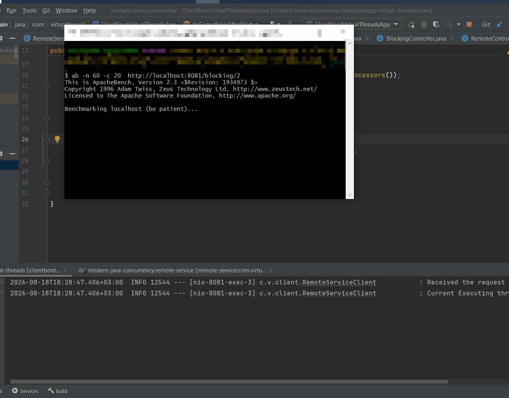
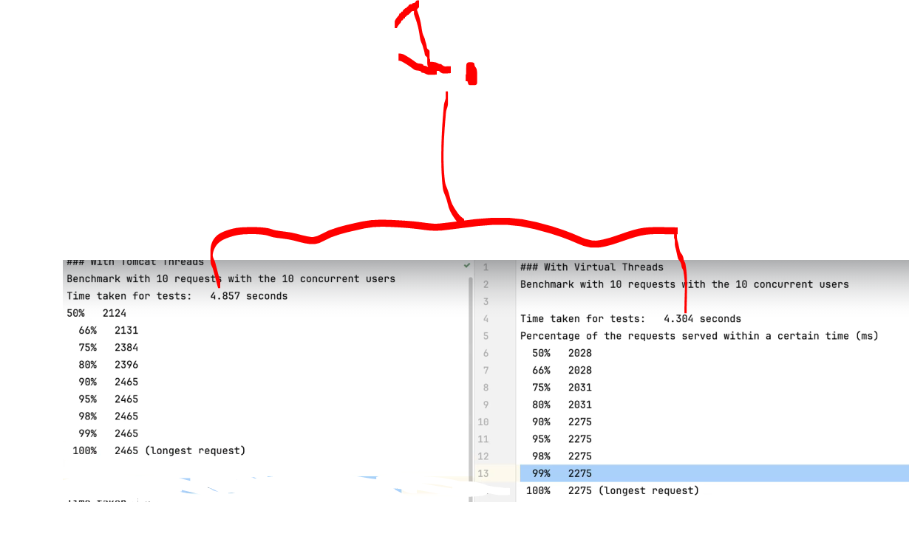
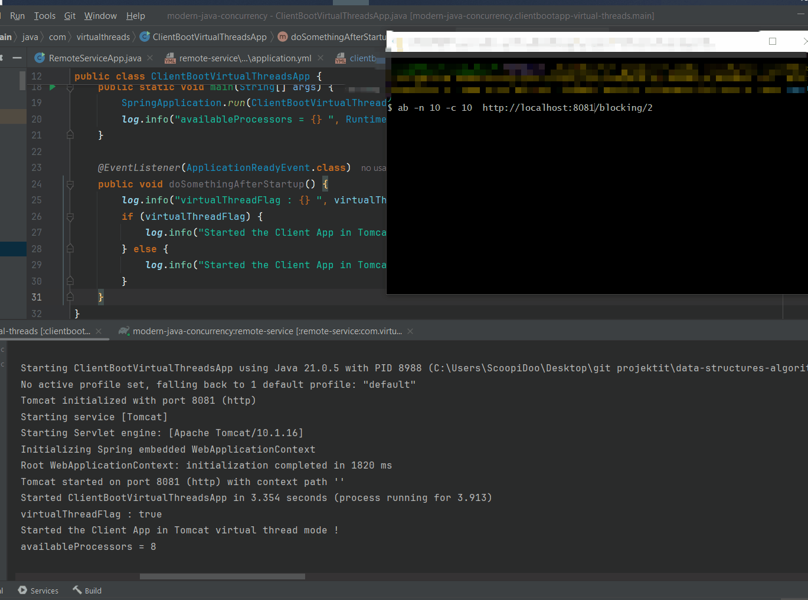
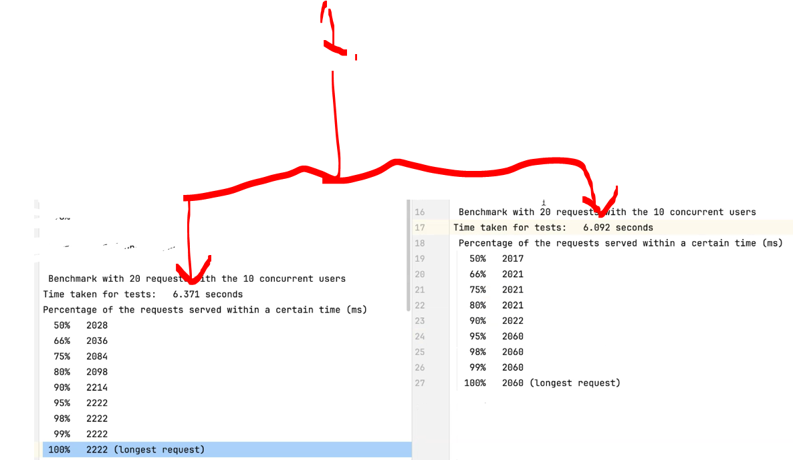
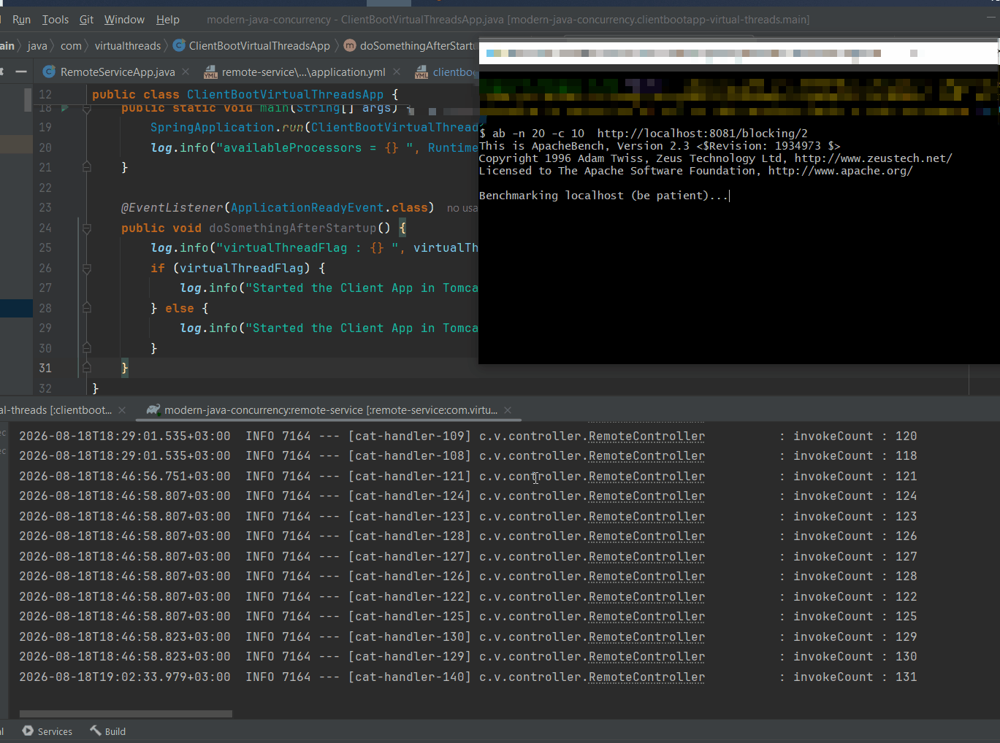
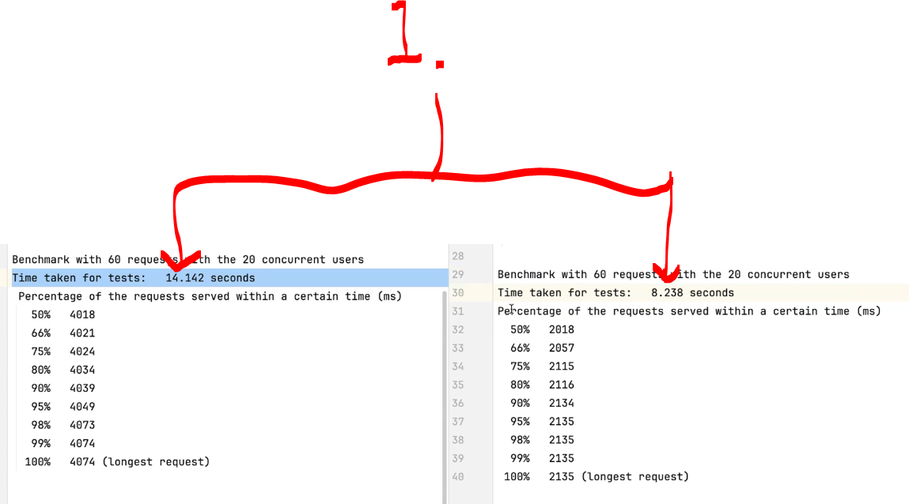

# Chapter 10 - Load Test using `ab` – Apache HTTP server benchmarking tool.

Load Test using `ab` – Apache HTTP server benchmarking tool.

# What I learned.

# Set up and run benchMarking using ab.

- We are using the project `clientbootapp-virtual-threads` [link](https://github.com/developersCradle/data-structures-algorithms-and-java-multithreading-concurrency-performance-optimization/tree/main/Modern%20Java%20%20Multithreading%20in%20Java%20using%20Virtual%20Threads/Section%2003/modern-java-concurrency/clientbootapp-virtual-threads)!

- Install [ab - Apache HTTP server benchmark tool link](https://github.com/dilipsundarraj1/modern-java-concurrency?tab=readme-ov-file#benchmarking-with-ab---apache-http-server-benchmarking-tool)!

# Load Test - VirtualThreads Spring MVC vs Traditional Spring MVC.

- Without **virtual threads**!
    ````Yml
    server:
    port: 8081
    tomcat:
        threads:
        max: 10
    #spring:
    #  threads:
    #    virtual:
    #      enabled: true
    ````

- Let's make benchmark `ab -n 10 -c 10  http://localhost:8080/blocking/2`.
    - `-n 10` → **10 requests total**!
    - `-c 10` → **10 requests at the same time**!

<div align="center">
    
</div>

- We get following log:
    ````Bash
    $ ab -n 10 -c 10  http://localhost:8080/blocking/2
    This is ApacheBench, Version 2.3 <$Revision: 1934973 $>
    Copyright 1996 Adam Twiss, Zeus Technology Ltd, http://www.zeustech.net/
    Licensed to The Apache Software Foundation, http://www.apache.org/

    Benchmarking localhost (be patient).....done

    Server Software:
    Server Hostname:        localhost
    Server Port:            8080

    Document Path:          /blocking/2
    Document Length:        28 bytes

    Concurrency Level:      10
    Time taken for tests:   4.056 seconds
    Complete requests:      10
    Failed requests:        0
    Total transferred:      1610 bytes
    HTML transferred:       280 bytes
    Requests per second:    2.34 [#/sec] (mean)
    Time per request:       4267.269 [ms] (mean)
    Time per request:       426.727 [ms] (mean, across all concurrent requests)
    Transfer rate:          0.37 [Kbytes/sec] received

    Connection Times (ms)
                min  mean[+/-sd] median   max
    Connect:        0    0   0.4      0       1
    Processing:  2025 2049  66.0   2028    2236
    Waiting:     2025 2048  65.1   2028    2233
    Total:       2026 2049  65.9   2028    2236

    Percentage of the requests served within a certain time (ms)
    50%   2028
    66%   2029
    75%   2030
    80%   2031
    90%   2236
    95%   2236
    98%   2236
    99%   2236
    100%   2236 (longest request)
    ````

- As we can see the request took: `Time taken for tests:   4.056 seconds`!

- Let's make benchmark `ab -n 20 -c 10  http://localhost:8080/blocking/2`.
    - 20 **total requests**.
    - 10 **concurrent requests at a time**.

<div align="center">
    
</div>

- We get following log:
    ````Bash
    $ ab -n 20 -c 10  http://localhost:8080/blocking/2
    This is ApacheBench, Version 2.3 <$Revision: 1934973 $>
    Copyright 1996 Adam Twiss, Zeus Technology Ltd, http://www.zeustech.net/
    Licensed to The Apache Software Foundation, http://www.apache.org/

    Benchmarking localhost (be patient).....done

    Server Software:
    Server Hostname:        localhost
    Server Port:            8080

    Document Path:          /blocking/2
    Document Length:        28 bytes

    Concurrency Level:      10
    Time taken for tests:   6.111 seconds
    Complete requests:      20
    Failed requests:        0
    Total transferred:      3220 bytes
    HTML transferred:       560 bytes
    Requests per second:    3.27 [#/sec] (mean)
    Time per request:       3055.512 [ms] (mean)
    Time per request:       305.551 [ms] (mean, across all concurrent requests)
    Transfer rate:          0.51 [Kbytes/sec] received

    Connection Times (ms)
                min  mean[+/-sd] median   max
    Connect:        0    1   0.5      1       1
    Processing:  2011 2032  12.7   2034    2053
    Waiting:     2011 2030  12.1   2031    2048
    Total:       2012 2033  12.8   2034    2054

    Percentage of the requests served within a certain time (ms)
    50%   2034
    66%   2042
    75%   2045
    80%   2045
    90%   2048
    95%   2054
    98%   2054
    99%   2054
    100%   2054 (longest request)
    ````

- As we can see the request took: `Time taken for tests: 6.111 seconds`!

> [!NOTE]
> 📝 Tomcat doesn't inherently mean **"10 requests max."** Its default configuration generally allows many more than **10** concurrent request-processing threads. 📝

- Lets make the **60** request at the time, but if we see we can see that **Tomcat** can handle the 20 at the time!
    - We can see **blocking I/O** and concurrency in **Tomcat**!

- Let's make benchmark `ab -n 60 -c 20  http://localhost:8080/blocking/2`!
    - `n 60` **— make 60 total requests**!
    - `c 20` **— allow 20 requests concurrently**!

<div align="center">
    
</div>

- We get following log:
    ````Bash
    $ ab -n 60 -c 20  http://localhost:8081/blocking/2
    This is ApacheBench, Version 2.3 <$Revision: 1934973 $>
    Copyright 1996 Adam Twiss, Zeus Technology Ltd, http://www.zeustech.net/
    Licensed to The Apache Software Foundation, http://www.apache.org/

    Benchmarking localhost (be patient).....done


    Server Software:
    Server Hostname:        localhost
    Server Port:            8081

    Document Path:          /blocking/2
    Document Length:        28 bytes

    Concurrency Level:      20
    Time taken for tests:   14.139 seconds
    Complete requests:      60
    Failed requests:        0
    Total transferred:      9660 bytes
    HTML transferred:       1680 bytes
    Requests per second:    4.24 [#/sec] (mean)
    Time per request:       4712.864 [ms] (mean)
    Time per request:       235.643 [ms] (mean, across all concurrent requests)
    Transfer rate:          0.67 [Kbytes/sec] received

    Connection Times (ms)
                min  mean[+/-sd] median   max
    Connect:        0    0   0.4      0       1
    Processing:  2015 3669 787.3   4035    4051
    Waiting:     2013 3668 787.6   4035    4051
    Total:       2015 3669 787.4   4035    4052

    Percentage of the requests served within a certain time (ms)
    50%   4035
    66%   4040
    75%   4043
    80%   4044
    90%   4049
    95%   4050
    98%   4050
    99%   4052
    ````

- As we can see the `Time taken for tests:   14.139 seconds`!
    -  We can see taking more time when there is **max tomcat threads**!

<div align="center">
    
</div>

- Next, we will be using the **Virtual Threads**!!
    ````Yml
    server:
    port: 8081
    tomcat:
        threads:
        max: 10
    spring:
      threads:
        virtual:
          enabled: true
    ````

- Let's make benchmark `ab -n 10 -c 10  http://localhost:8080/blocking/2`.
    - `-n 10` → **10 requests total**!
    - `-c 10` → **10 requests at the same time**!

<div align="center">
    
</div>

1. We can compare both time of threads execution time!
    - **Left:** Is using **Platform Thread**!
    - **Right:** Is using **Virtual Thread**!

- There is no big difference it this batch!

<div align="center">
    
</div>

- We get following log:
    ````Bash
    $ ab -n 10 -c 10  http://localhost:8081/blocking/2
    This is ApacheBench, Version 2.3 <$Revision: 1934973 $>
    Copyright 1996 Adam Twiss, Zeus Technology Ltd, http://www.zeustech.net/
    Licensed to The Apache Software Foundation, http://www.apache.org/

    Benchmarking localhost (be patient).....done


    Server Software:
    Server Hostname:        localhost
    Server Port:            8081

    Document Path:          /blocking/2
    Document Length:        28 bytes

    Concurrency Level:      10
    Time taken for tests:   4.298 seconds
    Complete requests:      10
    Failed requests:        0
    Total transferred:      1610 bytes
    HTML transferred:       280 bytes
    Requests per second:    2.33 [#/sec] (mean)
    Time per request:       4298.312 [ms] (mean)
    Time per request:       429.831 [ms] (mean, across all concurrent requests)
    Transfer rate:          0.37 [Kbytes/sec] received

    Connection Times (ms)
                min  mean[+/-sd] median   max
    Connect:        0    0   0.4      0       1
    Processing:  2019 2048  76.6   2022    2265
    Waiting:     2019 2047  76.1   2021    2263
    Total:       2019 2048  76.5   2022    2265

    Percentage of the requests served within a certain time (ms)
    50%   2022
    66%   2022
    75%   2033
    80%   2034
    90%   2265
    95%   2265
    98%   2265
    99%   2265
    100%   2265 (longest request)
    ````

- We can see we get the same **around the same execution time**!
    - As we can see the request took: `Time taken for tests:   4.298 seconds`!

- Let's make benchmark `ab -n 20 -c 10  http://localhost:8080/blocking/2`.
    - 20 **total requests**.
    - 10 **concurrent requests at a time**.

<div align="center">
    
</div>

1. We can compare both time of threads execution time!
    - **Left:** Is using **Platform Thread**!
    - **Right:** Is using **Virtual Thread**!

- There is no big difference, again!

<div align="center">
    
</div>

- We get following log:
    ````Bash
    $ ab -n 20 -c 10  http://localhost:8081/blocking/2
    This is ApacheBench, Version 2.3 <$Revision: 1934973 $>
    Copyright 1996 Adam Twiss, Zeus Technology Ltd, http://www.zeustech.net/
    Licensed to The Apache Software Foundation, http://www.apache.org/

    Benchmarking localhost (be patient).....done


    Server Software:
    Server Hostname:        localhost
    Server Port:            8081

    Document Path:          /blocking/2
    Document Length:        28 bytes

    Concurrency Level:      10
    Time taken for tests:   6.099 seconds
    Complete requests:      20
    Failed requests:        1
    (Connect: 0, Receive: 0, Length: 1, Exceptions: 0)
    Non-2xx responses:      1
    Total transferred:      3275 bytes
    HTML transferred:       643 bytes
    Requests per second:    3.28 [#/sec] (mean)
    Time per request:       3049.415 [ms] (mean)
    Time per request:       304.941 [ms] (mean, across all concurrent requests)
    Transfer rate:          0.52 [Kbytes/sec] received

    Connection Times (ms)
                min  mean[+/-sd] median   max
    Connect:        0    0   0.3      0       1
    Processing:   153 1936 420.0   2029    2055
    Waiting:      153 1935 419.7   2028    2054
    Total:        153 1936 420.0   2029    2055

    Percentage of the requests served within a certain time (ms)
    50%   2029
    66%   2036
    75%   2038
    80%   2044
    90%   2054
    95%   2055
    98%   2055
    99%   2055
    100%   2055 (longest request)
    ````

- We can see we get the same **around the same execution time**!
    - As we can see the request took: `Time taken for tests:   6.099 seconds`!

<div align="center">
    
</div>

1. We can compare both time of threads execution time!
    - **Left:** Is using **Virtual Thread**!
    - **Right:** Is using **Platform Thread**!

- Let's make benchmark `ab -n 60 -c 20  http://localhost:8080/blocking/2`!
    - `n 60` **— make 60 total requests**!
    - `c 20` **— allow 20 requests concurrently**!

<div align="center">
    
</div>

- We get following log:
    ````Bash
    $ ab -n 60 -c 20  http://localhost:8081/blocking/2
    This is ApacheBench, Version 2.3 <$Revision: 1934973 $>
    Copyright 1996 Adam Twiss, Zeus Technology Ltd, http://www.zeustech.net/
    Licensed to The Apache Software Foundation, http://www.apache.org/

    Benchmarking localhost (be patient).....done

    Server Software:
    Server Hostname:        localhost
    Server Port:            8081

    Document Path:          /blocking/2
    Document Length:        28 bytes

    Concurrency Level:      20
    Time taken for tests:   8.209 seconds
    Complete requests:      60
    Failed requests:        0
    Total transferred:      9660 bytes
    HTML transferred:       1680 bytes
    Requests per second:    7.31 [#/sec] (mean)
    Time per request:       2736.403 [ms] (mean)
    Time per request:       136.820 [ms] (mean, across all concurrent requests)
    Transfer rate:          1.15 [Kbytes/sec] received

    Connection Times (ms)
                min  mean[+/-sd] median   max
    Connect:        0    0   0.5      0       2
    Processing:  2012 2042  23.7   2040    2097
    Waiting:     2011 2042  23.5   2039    2097
    Total:       2013 2043  23.7   2040    2097

    Percentage of the requests served within a certain time (ms)
    50%   2040
    66%   2053
    75%   2065
    80%   2066
    90%   2076
    95%   2090
    98%   2093
    99%   2097
    100%   2097 (longest request)
    ````

- As we can see the `Time taken for tests:   8.209 seconds`!

<div align="center">
    
</div>

1. We can compare both time of threads execution time!
    - **Left:** Is using **Platform Thread**!
    - **Right:** Is using **Virtual Thread**!

- We can see that with the **Virtual Threads** **twice** times faster!
