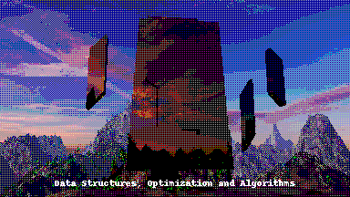

    
    <text>Attempt to study <b>Data Structures</b>, <b>Optimization</b> and <b>Algorithms</b> related topics!</text>

   

- For these courses one should configure **GIT** for handle projects.
    - `git config --global http.postBuffer 524288000`
    - `git config --global core.longpaths true`.

    

All course material from Java Multithreading, Concurrency & Performance Optimization by **Michael Pogrebinsky** and **Top Developer Academy LLC**.

Contains my own notes with some course material to enforce learning experience.

This repository is made with , therefore it will include configuration files which are related to this IDE this approach will be favored for now. ⚙️

[The course at Udemy](https://www.udemy.com/course/java-multithreading-concurrency-performance-optimization/). 

[Website of maker](https://topdeveloperacademy.com/).

If the content sparked :fire: your interest, please consider buying the course and start learning :book:.

<!-- 
Linkedin puts this shit front, when clicking from private mode x(. Need to put this to make jump working every case
?trk=public_profile_see-credential 
-->

    Insert certificate here when completed

**Note: The material provided in this repository is only for helping those who may get stuck at any point of time in the course. It is very advised that no one should just copy the solutions(violation of Honor Code) presented here.**

#### Progress/Curriculum.

- [x] [Section 01](https://github.com/developersCradle/data-structures-algorithms-and-java-multithreading-concurrency-performance-optimization/blob/main/Java%20Multithreading%2C%20Concurrency%20%26%20Performance%20Optimization/Section%2001/README.md#what-i-learned) - Introduction. ✅
- [x] [Section 02](https://github.com/developersCradle/data-structures-algorithms-and-java-multithreading-concurrency-performance-optimization/blob/main/Java%20Multithreading%2C%20Concurrency%20%26%20Performance%20Optimization/Section%2002/README.md#chapter-02---threading-fundamentals---thread-creation) - Threading Fundamentals - Thread Creation. ✅
- [ ] [Section 03](https://github.com/developersCradle/data-structures-algorithms-and-java-multithreading-concurrency-performance-optimization/tree/main/Java%20Multithreading%2C%20Concurrency%20%26%20Performance%20Optimization/Section%2003#chapter-03---threading-fundamentals---thread-coordination) - Threading Fundamentals - Thread Coordination.
- [ ] [Section 04](https://github.com/developersCradle/data-structures-algorithms-and-java-multithreading-concurrency-performance-optimization/tree/main/Java%20Multithreading%2C%20Concurrency%20%26%20Performance%20Optimization/Section%2004#chapter-04---performance-optimization) - Performance Optimization.
- [ ] [Section 05](https://github.com/developersCradle/data-structures-algorithms-and-java-multithreading-concurrency-performance-optimization/tree/main/Java%20Multithreading%2C%20Concurrency%20%26%20Performance%20Optimization/Section%2005#chapter-05---data-sharing-between-threads) - Data Sharing Between Threads.
- [ ] [Section 06](https://github.com/developersCradle/data-structures-algorithms-and-java-multithreading-concurrency-performance-optimization/tree/main/Java%20Multithreading%2C%20Concurrency%20%26%20Performance%20Optimization/Section%2006#chapter-06---the-concurrency-challenges--solutions) - The Concurrency Challenges & Solutions.
- [ ] [Section 07](https://github.com/developersCradle/data-structures-algorithms-and-java-multithreading-concurrency-performance-optimization/tree/main/Java%20Multithreading%2C%20Concurrency%20%26%20Performance%20Optimization/Section%2007#chapter-07---advanced-locking) - Advanced Locking.
- [ ] [Section 08](https://github.com/developersCradle/data-structures-algorithms-and-java-multithreading-concurrency-performance-optimization/tree/main/Java%20Multithreading%2C%20Concurrency%20%26%20Performance%20Optimization/Section%2008#chapter-08---inter-thread-communication) - Inter-Thread Communication.
- [ ] [Section 09](https://github.com/developersCradle/data-structures-algorithms-and-java-multithreading-concurrency-performance-optimization/tree/main/Java%20Multithreading%2C%20Concurrency%20%26%20Performance%20Optimization/Section%2009#chapter-09---lock-free-algorithms-data-structures--techniques) - Lock-Free Algorithms, Data-Structures & Techniques.
- [ ] [Section 10](https://github.com/developersCradle/data-structures-algorithms-and-java-multithreading-concurrency-performance-optimization/tree/main/Java%20Multithreading%2C%20Concurrency%20%26%20Performance%20Optimization/Section%2010#chapter-10---threading-models-for-high-performance-io) - Threading Models for High Performance IO.
- [ ] [Section 11](https://github.com/developersCradle/data-structures-algorithms-and-java-multithreading-concurrency-performance-optimization/blob/main/Java%20Multithreading%2C%20Concurrency%20%26%20Performance%20Optimization/Section%2011/README.md#chapter-11---virtual-threads-and-high-performance-io) - Virtual Threads and High-Performance IO.
- [ ] [Section 12](https://github.com/developersCradle/data-structures-algorithms-and-java-multithreading-concurrency-performance-optimization/tree/main/Java%20Multithreading%2C%20Concurrency%20%26%20Performance%20Optimization/Section%2012#chapter-12---extra-information---source-code-and-other-stuff) - Beyond Multithreading - Final Lecture.

    

    

All course material from Java Multithreading, Concurrency & Performance Optimization by **Michael Pogrebinsky** and **Top Developer Academy LLC**.

Contains my own notes with some course material to enforce learning experience.

This repository is made with , therefore it will include configuration files which are related to this IDE this approach will be favored for now. ⚙️

[The course at Udemy](https://www.udemy.com/course/java-multithreading-concurrency-performance-optimization/). 

[Website of maker](https://topdeveloperacademy.com/).

If the content sparked :fire: your interest, please consider buying the course and start learning :book:.

<!-- 
Linkedin puts this shit front, when clicking from private mode x(. Need to put this to make jump working every case
?trk=public_profile_see-credential 
-->

    Insert certificate here when completed

**Note: The material provided in this repository is only for helping those who may get stuck at any point of time in the course. It is very advised that no one should just copy the solutions(violation of Honor Code) presented here.**

#### Progress/Curriculum.

- [ ] [Section 01](#) - Getting Started With the Course.
- [ ] [Section 02](#) - Course Slides.
- [ ] [Section 03](#) - Getting Started with Parallel and Asynchronous Programming.
- [ ] [Section 04](#) - Course Project Setup.
- [ ] [Section 05](#) - Threads, Future, ForkJoin and its Limitations.
- [ ] [Section 06](#) - Getting Started with Parallel Streams.
- [ ] [Section 07](#) - Build Retail Checkout Application using Parallel Streams.
- [ ] [Section 08](#) - Parallel Streams - Under the Hood.
- [ ] [Section 09](#) - Parallel Streams - Threading Model & Common ForkJoin Pool.
- [ ] [Section 10](#) - Parallel Streams - Summary.
- [ ] [Section 11](#) - CompletableFuture.
- [ ] [Section 12](#) - Exploring CompletableFuture Functions.
- [ ] [Section 13](#) - Build ProductService Application using CompletableFuture.
- [ ] [Section 14](#) - Combining Streams and CompletableFuture. 
- [ ] [Section 15](#) - Exception Handling/Recovery in CompletableFuture.
- [ ] [Section 16](#) - Implement Exception Handling/Recovery in ProductService.
- [ ] [Section 17](#) - CompletableFuture & Threadpool.
- [ ] [Section 18](#) - Threads and Async Overloaded Methods in CompletableFuture.
- [ ] [Section 19](#) - Build Restful API Client using Spring WebClient and CompletableFuture.
- [ ] [Section 20](#) - Handle Multiple CompletableFutures - anyOf(), allOf().

    

All course material from **Data Structures and Algorithms with Visualizations with Java** by from **Dinesh Varyani**.

This repository is made with , therefore it will include configuration files which are related to this IDE this approach will be favored for now. ⚙️

**Main**: [YouTube Source](https://www.youtube.com/playlist?list=PLe8LZCtW06l-WqVgtvL2Y_4BRrxcEbsg_).

**Optional**: [freeCodeCamp](https://www.freecodecamp.org/news/learn-data-structures-and-algorithms-2/).

**Optional**: [YouTube Source](https://www.youtube.com/playlist?list=PLe8LZCtW06l-WqVgtvL2Y_4BRrxcEbsg_).

[Source Codes](https://github.com/dinesh-varyani/ds-algos).

If the content sparked :fire: your interest, please consider starting the course and start learning :book:.

<!-- 
Linkedin puts this shit front, when clicking from private mode x(. Need to put this to make jump working every case
?trk=public_profile_see-credential 
-->

    Insert certificate here when completed

**Note: The material provided in this repository is only for helping those who may get stuck at any point of time in the course. It is very advised that no one should just copy the solutions(violation of Honor Code) presented here.**

#### Progress/Curriculum.

- [x] Introduction 00 - Data Structures and Algorithms with Visualizations. ✅
- [x] [Introduction 01](https://github.com/developersCradle/data-structures-and-algorithms/tree/main/01%20Introduction%20to%20Data%20Structures) - Introduction to Data Structures. ✅
- [x] [Introduction 02](https://github.com/developersCradle/data-structures-and-algorithms/tree/main/02%20Introduction%20to%20Algorithms) - Introduction to Algorithms. ✅
- [x] [Introduction 03](https://github.com/developersCradle/data-structures-and-algorithms/tree/main/03%20Introduction%20to%20Algorithm%20Analysis) - Introduction to Algorithm Analysis. ✅
- [x] [Introduction 04](https://github.com/developersCradle/data-structures-and-algorithms/tree/main/04%20Time%20Complexity%20of%20an%20Algorithm) - Time Complexity of an Algorithm. ✅
- [x] [Introduction 05](https://github.com/developersCradle/data-structures-and-algorithms/tree/main/05%20Space%20Complexity%20of%20an%20Algorithm) - Space Complexity of an Algorithm. ✅
- [x] [Introduction 06](https://github.com/developersCradle/data-structures-and-algorithms/tree/main/06%20Asymptotic%20Analysis%20of%20an%20Algorithm) - Asymptotic Analysis of an Algorithm. ✅
- [x] [Introduction 07](https://github.com/developersCradle/data-structures-and-algorithms/tree/main/07%20Aymptotic%20Notations%2C%20Omega%2C%20Theta%20and%20Big%20O%20Notation) - Asymptotic Notations | Omega, Theta and Big O Notations. ✅
- [x] [Introduction 08](https://github.com/developersCradle/data-structures-and-algorithms/tree/main/08%20Types%20of%20Asymptotic%20Notations) - Types of Asymptotic Notations. ✅
- [x] [Introduction 09](https://github.com/developersCradle/data-structures-and-algorithms/tree/main/09%20Calculating%20Time%20complexity%20of%20Constant%20Algorithm%20(Big%20O)) - Analysis and Rules to calculate Big O notation. ✅
- [x] [Introduction 10](https://github.com/developersCradle/data-structures-and-algorithms/tree/main/10%20Calculating%20Time%20complexity%20of%20Constant%20Algorithm%20(Big%20O)) - Calculating Time complexity of Constant Algorithm (Big O). ✅
- [x] [Introduction 11](https://github.com/developersCradle/data-structures-and-algorithms/tree/main/11%20Calculating%20Time%20complexity%20of%20a%20Linear%20Algorithm%20(Big%20O)) - Calculating Time complexity of a Linear Algorithm (Big O). ✅
- [x] [Introduction 12](https://github.com/developersCradle/data-structures-and-algorithms/tree/main/12%20Calculating%20Time%20complexity%20of%20a%20Polynomial%20Algorithm%20(Big%20O)) - Calculating Time complexity of a Polynomial Algorithm (Big O). ✅
- [x] [Introduction 13](https://github.com/developersCradle/data-structures-and-algorithms/tree/main/13%20Introduction%20to%20One-Dimensional%20Array) - Introduction to One-Dimensional Array. ✅
- [x] [Introduction 14](https://github.com/developersCradle/data-structures-and-algorithms/tree/main/14%20Declaration%20and%20Initialization%20of%20a%20One-Dimensional%20Array) - Declaration and Initialization of a One-Dimensional Array. ✅
- [x] [Introduction 15](https://github.com/developersCradle/data-structures-and-algorithms/tree/main/15%20Adding%20or%20Updating%20elements%20in%20a%20One-Dimensional%20Array%20and%20Implementatio) - Adding or Updating elements in a One-Dimensional Array | Implementation. ✅
- [x] [Introduction 16](https://github.com/developersCradle/data-structures-and-algorithms/tree/main/16%20How%20to%20print%20elements%20of%20an%20Array%20in%20Java.%20Animation) - How to print elements of an Array in Java? | Animation. ✅
- [x] [Introduction 17](https://github.com/developersCradle/data-structures-and-algorithms/tree/main/17%20How%20to%20print%20elements%20of%20an%20Array%20in%20Java.%20Implementation) - How to print elements of an Array in Java? | Implementation ✅
- [x] [Introduction 18](https://github.com/developersCradle/data-structures-and-algorithms/tree/main/18%20Remove%20Even%20Integers%20from%20an%20Array.%20Animation.%20Coding%20Interview%20Question) - **Remove Even Integers** from an Array | Animation | Coding Interview Question. ✅
- [x] [Introduction 19](https://github.com/developersCradle/data-structures-and-algorithms/tree/main/19%20Remove%20Even%20Integers%20from%20an%20Array.%20Implementation%20Coding.%20Interview%20Question) - **Remove Even Integers** from an Array | Implementation | Coding Interview Question. ✅
- [x] [Introduction 20](https://github.com/developersCradle/data-structures-and-algorithms/tree/main/20%20How%20to%20Reverse%20an%20Array%20in%20Java%20-%20Animation) - How to **Reverse an Array** in Java - Animation. ✅
- [x] [Introduction 21](https://github.com/developersCradle/data-structures-and-algorithms/tree/main/21%20How%20to%20reverse%20an%20array%20in%20Java.%20Implementation) - How to **Reverse an Array** in Java? | Implementation. ✅
- [ ] [Introduction 22](https://github.com/developersCradle/data-structures-and-algorithms/tree/main/22%20How%20to%20find%20Minimum%20value%20in%20an%20Array.%20Animation) - How to find Minimum value in an Array? | Animation. ✅
- [ ] [Introduction 23](https://github.com/developersCradle/data-structures-and-algorithms/tree/main/23%20How%20to%20find%20Minimum%20value%20in%20an%20Array.%20%20Implementation) - How to find Minimum value in an Array? | Implementation.
- [ ] [Introduction 24](#) - 
- [ ] [Introduction 25](#) -
- [ ] [Introduction 26](#) -
- [ ] [Introduction 27](#) -
- [ ] [Introduction 28](#) -
- [ ] [Introduction 29](#) -
- [ ] [Introduction 30](#) -
- [ ] [Introduction 31](#) -
- [ ] [Introduction 32](#) -
- [ ] [Introduction 33](#) -
- [ ] [Introduction 34](#) -
- [ ] [Introduction 35](#) -
- [x] [Introduction 36](https://github.com/developersCradle/data-structures-and-algorithms/tree/main/36%20Represent%20a%20Singly%20Linked%20List) - Represent a **Singly Linked List** in Java. ✅
- [x] [Introduction 37](https://github.com/developersCradle/data-structures-and-algorithms/tree/main/37%20How%20to%20Implement%20a%20Singly%20Linked%20List%20in%20Java.%20Data%20Structures%20and%20Algorithms) - How to Implement a **Singly Linked List** in Java | **Data Structures** and Algorithms. ✅
- [x] [Introduction 38](https://github.com/developersCradle/data-structures-and-algorithms/tree/main/38%20Create%20a%20Singly%20Linked%20List%20in%20Java%20(Animation)) - Create a **Singly Linked List** in Java (Animation). ✅
- [x] [Introduction 39](https://github.com/developersCradle/data-structures-and-algorithms/tree/main/39%20Create%20a%20Singly%20Linked%20List%20in%20Java%20(Implementation)) - Create a **Singly Linked List** in Java (Implementation). ✅
- [x] [Introduction 40](https://github.com/developersCradle/data-structures-and-algorithms/tree/main/40%20Print%20elements%20of%20a%20Singly%20Linked%20List%20in%20Java%20(Animation)) - Print elements of a **Singly Linked List** in Java (Animation). ✅
- [x] [Introduction 41](https://github.com/developersCradle/data-structures-and-algorithms/tree/main/41%20Print%20elements%20of%20a%20Singly%20Linked%20List%20in%20Java%20(Implementation)) - Print elements of a **Singly Linked List** in Java (Implementation).
- [x] [Introduction 42](https://github.com/developersCradle/data-structures-and-algorithms/tree/main/42%20Find%20length%20of%20a%20Singly%20Linked%20List%20in%20Java%20(Animation)) - Find length of a **Singly Linked List** in Java (Animation). ✅
- [x] [Introduction 43](https://github.com/developersCradle/data-structures-and-algorithms/tree/main/42%20Find%20length%20of%20a%20Singly%20Linked%20List%20in%20Java%20(Animation)) - Find length of a **Singly Linked List** in Java (Implementation). ✅
- [x] [Introduction 44](https://github.com/developersCradle/data-structures-and-algorithms/tree/main/44%20Insert%20node%20at%20the%20beginning%20of%20a%20Singly%20Linked%20List%20in%20Java%20(Animation)) - Insert node at the beginning of a **Singly Linked List** in Java (Animation). ✅
- [x] [Introduction 45](https://github.com/developersCradle/data-structures-and-algorithms/tree/main/45%20Insert%20node%20at%20the%20beginning%20of%20a%20Singly%20Linked%20List%20in%20Java%20(Implementation)) - Insert node at the beginning of a **Singly Linked List** in Java (Implementation). ✅
- [x] [Introduction 46](https://github.com/developersCradle/data-structures-and-algorithms/tree/main/46%20Insert%20node%20at%20the%20end%20of%20a%20Singly%20Linked%20List%20in%20Java%20(Animation)) - Insert node at the end of a **Singly Linked List** in Java (Animation). ✅
- [x] [Introduction 47](https://github.com/developersCradle/data-structures-and-algorithms/tree/main/47%20Insert%20node%20at%20the%20end%20of%20a%20Singly%20Linked%20List%20in%20Java%20(Implementation)) - Insert node at the end of a **Singly Linked List** in Java (Implementation). ✅
- [x] [Introduction 48](#) - Insert a node in a **Singly Linked List** at a given position (Animation). ✅
- [x] [Introduction 49](#) - Insert a node in a **Singly Linked List** at a given position (Implementation). ✅
- [ ] [Introduction 50](#) - Delete first node of a **Singly Linked List** in Java (Animation).
- [ ] [Introduction 51](#) -
- [ ] [Introduction 52](#) -
- [ ] [Introduction 53](#) -
- [ ] [Introduction 54](#) -
- [ ] [Introduction 55](#) -
- [ ] [Introduction 56](#) -
- [ ] [Introduction 57](#) -
- [ ] [Introduction 58](#) -
- [ ] [Introduction 59](#) -
- [ ] [Introduction 60](#) -
- [ ] [Introduction 61](#) -
- [ ] [Introduction 62](#) -
- [ ] [Introduction 63](#) -
- [ ] [Introduction 64](#) -
- [ ] [Introduction 65](#) -
- [ ] [Introduction 66](#) -
- [ ] [Introduction 67](#) -
- [ ] [Introduction 68](#) -
- [ ] [Introduction 69](#) -
- [ ] [Introduction 70](#) -
- [ ] [Introduction 71](#) -
- [ ] [Introduction 72](#) -
- [ ] [Introduction 73](#) -
- [ ] [Introduction 74](#) -
- [ ] [Introduction 75](#) -
- [ ] [Introduction 76](#) -
- [ ] [Introduction 77](#) -
- [ ] [Introduction 78](#) -
- [ ] [Introduction 79](#) -
- [ ] [Introduction 80](#) -
- [ ] [Introduction 81](#) -
- [ ] [Introduction 82](#) -
- [ ] [Introduction 83](#) -
- [ ] [Introduction 84](#) -
- [ ] [Introduction 85](#) -
- [ ] [Introduction 86](#) -
- [ ] [Introduction 87](#) -
- [ ] [Introduction 88](#) -
- [ ] [Introduction 89](#) -
- [ ] [Introduction 90](#) -
- [ ] [Introduction 91](#) -
- [ ] [Introduction 92](#) -
- [ ] [Introduction 93](#) -
- [ ] [Introduction 94](#) -
- [ ] [Introduction 95](#) -
- [ ] [Introduction 96](#) -
- [ ] [Introduction 97](#) -
- [ ] [Introduction 98](#) -
- [ ] [Introduction 99](#) -
- [ ] [Introduction 100](#) -

#### Additional stuff.

- [ ] Add first captions for all the chapters, like `#someThing`, so can be linked.

    

    

todo this desc.

Contains my own notes with some course material to enforce learning experience.

This repository is made with , therefore it will include configuration files which are related to this IDE this approach will be favored for now. ⚙️

[freeCodeCamp](https://www.freecodecamp.org/news/learn-data-structures-from-a-google-engineer/).

[GitHub repo](https://github.com/williamfiset/DEPRECATED-data-structures).

If the content sparked :fire: your interest, please consider buying the course and start learning :book:.

<!-- 
Linkedin puts this shit front, when clicking from private mode x(. Need to put this to make jump working every case
?trk=public_profile_see-credential 
-->

    Insert certificate here when completed

**Note: The material provided in this repository is only for helping those who may get stuck at any point of time in the course. It is very advised that no one should just copy the solutions(violation of Honor Code) presented here.**

#### Progress/Curriculum.

- [ ] [Section 01](#) - Add here.

    

    

All course material from Data Structures and Algorithms: Deep Dive Using Java by **Goran Lochert**, **Tim Buchalka** and **Tim Buchalka's Learn Programming Academy**.

Contains my own notes with some course material to enforce learning experience.

This repository is made with  with **Eclipse** hotkeys. This is why it will include configuration files which are related to this IDE this approach will be favored for now. ⚙️

[The course at Udemy](https://www.udemy.com/course/data-structures-and-algorithms-deep-dive-using-java). 

[Website of maker 1](https://www.timbuchalka.com/).

[Website of maker 2](https://jojoguruacademy.blogspot.com/).

[Website of maker 3](https://learnprogramming.academy/).

If the content sparked :fire: your interest, please consider buying the course and start learning :book:.

<!-- 
Linkedin puts this shit front, when clicking from private mode x(. Need to put this to make jump working every case
?trk=public_profile_see-credential 
-->

    Insert certificate here when completed

**Note: The material provided in this repository is only for helping those who may get stuck at any point of time in the course. It is very advised that no one should just copy the solutions(violation of Honor Code) presented here.**

#### Progress/Curriculum.

- [x] [Section 01](https://github.com/developersCradle/data-structures-algorithms-and-java-multithreading-concurrency-performance-optimization/tree/main/Data%20Structures%20and%20Algorithms%20Deep%20Dive%20Using%20Java/Section%2001#section-1---introduction) - Introduction. ✅
- [ ] [Section 02](https://github.com/developersCradle/data-structures-algorithms-and-java-multithreading-concurrency-performance-optimization/tree/main/Data%20Structures%20and%20Algorithms%20Deep%20Dive%20Using%20Java/Section%2002#section-2---arrays-and-big-o-notation) - Arrays and Big-O Notation.
- [ ] [Section 03](#) - Sort Algorithms Deep Dive.
- [ ] [Section 04](#) - Mastering Lists in Java: Implementations and Applications.
- [ ] [Section 05](#) - Stack Data Structures: Implementation and Use Cases.
- [ ] [Section 06](#) - Mastering Queue Data Structures: Implementation and Applications in Java.
- [ ] [Section 07](#) - Hash Tables: Mastering Key-Value Data Structures for Efficient Data Retrieval.
- [ ] [Section 08](#) - Optimized Search Algorithms in Java: Linear and Binary Search.
- [ ] [Section 09](#) - Mastering Tree Data Structures: Implementation and Optimization in Java.
- [ ] [Section 10](#) - Mastering Heaps: Priority Queues and Heapsort Algorithm in Java.
- [ ] [Section 11](#) - Final Section: Concluding the Course with Key Takeaways and Sets.
- [ ] [Section 12](#) - Extra Information - Source code, and other stuff.

    

    

All course material from **Java Application Performance Tuning and Memory Management** by from **Matt Greencroft** and **Virtual Pair Programmers** with my own visual notes. ✍️

This repository is made with , therefore it will include configuration files which are related to this IDE this approach will be favored for now. ⚙️

[Udemy](https://www.udemy.com/course/java-application-performance-and-memory-management).

[Homepage of maker](https://www.virtualpairprogrammers.com/).

If the content sparked :fire: your interest, please consider starting the course and start learning :book:.

<!-- 
Linkedin puts this shit front, when clicking from private mode x(. Need to put this to make jump working every case
?trk=public_profile_see-credential 
-->

    Insert certificate here when completed

**Note: The material provided in this repository is only for helping those who may get stuck at any point of time in the course. It is very advised that no one should just copy the solutions(violation of Honor Code) presented here.**

#### Progress/Curriculum.

- [ ] [Chapter 01](https://github.com/developersCradle/data-structures-algorithms-and-java-multithreading-concurrency-performance-optimization/tree/main/Java%20Application%20Performance%20Tuning%20and%20Memory%20Management/Section%2001#chapter-1---introduction) - Introduction.
- [ ] [Chapter 02](#) - Just In Time Compilation and the Code Cache.
- [ ] [Chapter 03](#) - Selecting the JVM.
- [ ] [Chapter 04](#) - How memory works: the stack and the heap.
- [ ] [Chapter 05](#) - Passing objects between methods.
- [ ] [Chapter 06](#) - Memory exercise.
- [ ] [Chapter 07](#) - Escaping References.
- [ ] [Chapter 08](#) - Memory Exercise.
- [ ] [Chapter 09](#) - The Metaspace and internal JVM memory optimisations.
- [ ] [Chapter 10](#) - Tuning the JVM’s Memory Settings.
- [ ] [Chapter 11](#) - Introducing Garbage Collection.
- [ ] [Chapter 12](#) - Monitoring the Heap.
- [ ] [Chapter 13](#) - Analyzing a heap dump.
- [ ] [Chapter 14](#) - Generational Garbage Collection.
- [ ] [Chapter 15](#) - Garbage Collector tuning & selection.
- [ ] [Chapter 16](#) - Using a profiler to analyse application performance.
- [ ] [Chapter 17](#) - Assessing Performance.
- [ ] [Chapter 18](#) - Benchmarking with JMH.
- [ ] [Chapter 19](#) - Performance and Benchmarking Exercise.
- [ ] [Chapter 20](#) - How Lists Work.
- [ ] [Chapter 21](https://github.com/developersCradle/data-structures-algorithms-and-java-multithreading-concurrency-performance-optimization/tree/main/Java%20Application%20Performance%20Tuning%20and%20Memory%20Management/Section%2021#section-21-chapter-21---how-maps-work) - How Maps Work.

#### Additional stuff.

- [x] Check the content from other student [Link](https://github.com/tommic81/udemy-java-memory-management/tree/master). ✅