<!-- 

We are using following structure:

<p align="center">
    gt
</p> 
<p align="center">
    
</p>

-->

<!--
Template for the questions:

# Quiz 07: Atomic Operations, Volatile & Metrics Practical Example.

<details>
<summary id="Question_01" open="true"> <b>Question 01.</b> </summary>
````Yaml
Question 01:
The question comes here!

- My answer:

<div align="center">
    
</div>

1. Add here the answer!

</details>
-->

<!-- 
Template for the task/exercies:
 
# Lab Exercise - Mapping Collections of Value Types.

<div align="center">
    
</div>

1. **Question 1:** add here the question from the test!
	- **Answer:** **D**. here can be the examplaniton!
 -->

<p align="center">
    
    <text>Attempt to study <b>Data Structures</b>, <b>Optimization</b> and <b>Algorithms</b> related topics!</text>
</p>

<p align="center">
   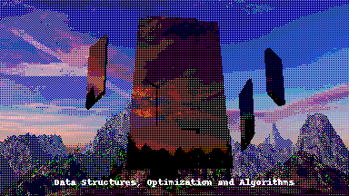
</p>

- For these courses one should configure **GIT** for handle projects.
    - `git config --global http.postBuffer 524288000`.
    - `git config --global core.longpaths true`.

<p align="center">
    
</p>

<p align="center">
    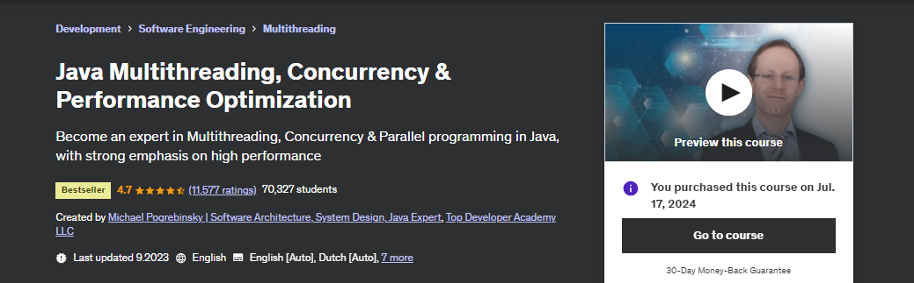
</p>

All course material from *Java Multithreading, Concurrency & Performance Optimization* by **Michael Pogrebinsky** and **Top Developer Academy LLC**.

> While working in the 🏛️**Nordea**🏛️, we were working with an old legacy system that was making **two concurrent** calls to a shared resource, causing inconsistent results that only appeared sometimes. The issue was subtle and difficult to reproduce, making it even harder to diagnose. What made it even harder was not runnable on our local environment! 
>
> A recent course I had taken on *Java Multithreading Concurrency And Performance Optimization* proved invaluable. It helped me identify the race condition and apply the `synchronized` keyword correctly to control access to the critical section. With proper thread coordination in place, the system stabilized without requiring a major rewrite of the legacy code. <br><br>
~ *DevelopersCradle*

Contains my own with my own visual notes ✍️ with some course material to enforce learning experience.

This repository is made with [](#) with [](#) hotkeys, therefore it will include configuration files which are related to this IDE this approach will be favored for now. ⚙️

[The course at Udemy](https://www.udemy.com/course/java-multithreading-concurrency-performance-optimization/). 

[Website of maker](https://topdeveloperacademy.com/).

If the content sparked :fire: your interest, please consider buying the course and start learning :book:.

<!-- 
Linkedin puts this shit front, when clicking from private mode x(. Need to put this to make jump working every case
?trk=public_profile_see-credential 
-->

<p id="Logo_Combination" align="center">
    
    
</p>

**Note: The material provided in this repository is only for helping those who may get stuck at any point of time in the course. It is very advised that no one should just copy the solutions(violation of Honor Code) presented here.**

#### Progress/Curriculum.

- [x] [Section 01](https://github.com/developersCradle/data-structures-algorithms-and-java-multithreading-concurrency-performance-optimization/tree/main/Java%20Multithreading%2C%20Concurrency%20and%20Performance%20Optimization/Section%2001#chapter-01---introduction) - Introduction. ✅
- [x] [Section 02](https://github.com/developersCradle/data-structures-algorithms-and-java-multithreading-concurrency-performance-optimization/tree/main/Java%20Multithreading%2C%20Concurrency%20and%20Performance%20Optimization/Section%2002#chapter-02---threading-fundamentals---thread-creation) - Threading Fundamentals - Thread Creation. ✅
- [x] [Section 03](https://github.com/developersCradle/data-structures-algorithms-and-java-multithreading-concurrency-performance-optimization/tree/main/Java%20Multithreading%2C%20Concurrency%20and%20Performance%20Optimization/Section%2003#chapter-03---threading-fundamentals---thread-coordination) - Threading Fundamentals - Thread Coordination. ✅
- [ ] [Section 04](https://github.com/developersCradle/data-structures-algorithms-and-java-multithreading-concurrency-performance-optimization/tree/main/Java%20Multithreading%2C%20Concurrency%20and%20Performance%20Optimization/Section%2004#chapter-04---performance-optimization) - Performance Optimization.  ⚠️ In progress! ⚠️
- [x] [Section 05](https://github.com/developersCradle/data-structures-algorithms-and-java-multithreading-concurrency-performance-optimization/blob/main/Java%20Multithreading%2C%20Concurrency%20and%20Performance%20Optimization/Section%2005/README.md#chapter-05---data-sharing-between-threads) - Data Sharing Between Threads. ✅
- [ ] [Section 06](https://github.com/developersCradle/data-structures-algorithms-and-java-multithreading-concurrency-performance-optimization/blob/main/Java%20Multithreading%2C%20Concurrency%20and%20Performance%20Optimization/Section%2006/README.md#chapter-06---the-concurrency-challenges--solutions) - The Concurrency Challenges & Solutions.  ⚠️ In progress! ⚠️
- [ ] [Section 07](https://github.com/developersCradle/data-structures-algorithms-and-java-multithreading-concurrency-performance-optimization/tree/main/Java%20Multithreading%2C%20Concurrency%20and%20Performance%20Optimization/Section%2007#chapter-07---advanced-locking) - Advanced Locking.
- [ ] [Section 08](https://github.com/developersCradle/data-structures-algorithms-and-java-multithreading-concurrency-performance-optimization/tree/main/Java%20Multithreading%2C%20Concurrency%20and%20Performance%20Optimization/Section%2008#chapter-08---inter-thread-communication) - Inter-Thread Communication.
- [ ] [Section 09](https://github.com/developersCradle/data-structures-algorithms-and-java-multithreading-concurrency-performance-optimization/tree/main/Java%20Multithreading%2C%20Concurrency%20and%20Performance%20Optimization/Section%2009#chapter-09---lock-free-algorithms-data-structures--techniques) - Lock-Free Algorithms, Data-Structures & Techniques.
- [ ] [Section 10](https://github.com/developersCradle/data-structures-algorithms-and-java-multithreading-concurrency-performance-optimization/blob/main/Java%20Multithreading%2C%20Concurrency%20and%20Performance%20Optimization/Section%2010/README.md#chapter-10---threading-models-for-high-performance-io) - Threading Models for High Performance IO.
- [ ] [Section 11](https://github.com/developersCradle/data-structures-algorithms-and-java-multithreading-concurrency-performance-optimization/blob/main/Java%20Multithreading%2C%20Concurrency%20and%20Performance%20Optimization/Section%2010/README.md#chapter-10---threading-models-for-high-performance-io) - Virtual Threads and High-Performance IO.
- [ ] [Section 12](https://github.com/developersCradle/data-structures-algorithms-and-java-multithreading-concurrency-performance-optimization/tree/main/Java%20Multithreading%2C%20Concurrency%20and%20Performance%20Optimization/Section%2012#chapter-12---extra-information---source-code-and-other-stuff) - Beyond Multithreading - Final Lecture.
- [ ] [Additional](https://github.com/developersCradle/data-structures-algorithms-and-java-multithreading-concurrency-performance-optimization/tree/main/Java%20Multithreading%2C%20Concurrency%20and%20Performance%20Optimization/Additional#additional-turun-yliopisto-threadss%C3%A4ikeet) - Turun yliopisto threads/säikeet.

#### Additional stuff.

- Add the coding exercises to the chapters 
- Get know to binary tree, before advancing the `ReentrantReadWriteLock`.
- Add the solution exercises to the list!
- [ ] Add the exercise and comments for the `We_Can_See_That_We_Dont_Have_The_Access_To_The_Main_Frame.PNG`, if you have patience.
- [ ] Additional go thought [Future](https://www.baeldung.com/java-future).
- [ ] Additional go thought `synchronized` [keyword](https://www.baeldung.com/java-synchronized).
- [ ] Go thought the definition of the `throughput` chapter.

- Remove the files archive files when course is finished!
- After this course ask yourself, *how is the single treated programming different from the multithreaded programming?* 

<hr>

<details>

<summary id="Cleaning_Quiz" open="true"> <b>Cleaning process of the quizes and the exercices! </b></summary>
<br>

- Cleaning the numbering from the exercise and quizes, they should be `01` rather than `1` chapter by chapter:
    - [x] Chapter 01.
    - [ ] Chapter 02.
    - [x] Chapter 03.
    - [ ] Chapter 04.
    - [ ] Chapter 05.
    - [ ] Chapter 06.
    - [ ] Chapter 07.
    - [ ] Chapter 08.
    - [ ] Chapter 09.
    - [ ] Chapter 10.
    - [ ] Chapter 11.
    - [ ] Chapter 12.
</details>

<details>

<summary id="Cleaning_Images" open="true"> <b>Cleaning process the images names! </b></summary>
<br>

- Cleaning the images in the format `Image_Next_Number`, this will be chapter by chapter:
    - [x] Chapter 01.
    - [ ] Chapter 02.
    - [ ] Chapter 03.
    - [ ] Chapter 04.
    - [ ] Chapter 05.
    - [ ] Chapter 06.
    - [ ] Chapter 07.
    - [ ] Chapter 08.
    - [ ] Chapter 09.
    - [ ] Chapter 10.
    - [ ] Chapter 11.
    - [ ] Chapter 12.
</details>

<details>

<summary id="Cleaning_Images_Links" open="true"> <b>Cleaning the images with the link and right alt tag! </b></summary>
<br>

- Bigger ink in the pictures, this will be chapter by chapter:
    - [x] Chapter 01. 
    - [ ] Chapter 02.
    - [ ] Chapter 03.
    - [ ] Chapter 04.
    - [ ] Chapter 05.
    - [ ] Chapter 06.
    - [ ] Chapter 07.
    - [ ] Chapter 08.
    - [ ] Chapter 09.
    - [ ] Chapter 10.
    - [ ] Chapter 11.
    - [ ] Chapter 12.
</details>

<hr>

#### The Quizzes and Labs.

* **Section 01**:
    * *Quiz*:
        * [Quiz 01: Threading and Operating Systems Fundamentals](https://github.com/developersCradle/data-structures-algorithms-and-java-multithreading-concurrency-performance-optimization/tree/main/Java%20Multithreading%2C%20Concurrency%20and%20Performance%20Optimization/Section%2001#quiz-01-threading-and-operating-systems-fundamentals-quiz).
* **Section 02**:
    * *Quiz*:
        * [Quiz 02: Thread Creation](#).
     * *Coding Exercise*:
        * [Coding Exercise 02: Multithreaded Calculation](https://github.com/developersCradle/data-structures-algorithms-and-java-multithreading-concurrency-performance-optimization/tree/main/Java%20Multithreading%2C%20Concurrency%20and%20Performance%20Optimization/Section%2003#coding-exercise-02-multithreaded-calculation).
* **Section 03**:
    * *Quiz*:
        * [Quiz 03: Thread Termination & Daemon Threads](https://github.com/developersCradle/data-structures-algorithms-and-java-multithreading-concurrency-performance-optimization/tree/main/Java%20Multithreading,%20Concurrency%20and%20Performance%20Optimization/Section%2003#quiz-03-thread-termination--daemon-threads).
    * *Coding Exercise*:
        * [Coding Exercise 02: Multithreaded Calculation](https://github.com/developersCradle/data-structures-algorithms-and-java-multithreading-concurrency-performance-optimization/tree/main/Java%20Multithreading,%20Concurrency%20and%20Performance%20Optimization/Section%2003#coding-exercise-02-multithreaded-calculation).
        * [Coding Exercise 02: Multithreaded Calculation - Solution](https://github.com/developersCradle/data-structures-algorithms-and-java-multithreading-concurrency-performance-optimization/tree/main/Java%20Multithreading,%20Concurrency%20and%20Performance%20Optimization/Section%2003#coding-exercise-02-multithreaded-calculation---solution).
* **Section 04**:
    * *Quiz*:
        * [Quiz 04: Performance Optimization](https://github.com/developersCradle/data-structures-algorithms-and-java-multithreading-concurrency-performance-optimization/tree/main/Java%20Multithreading%2C%20Concurrency%20and%20Performance%20Optimization/Section%2004#quiz-04-performance-optimization).
* **Section 05**:
    * *Quiz*:
        * [Quiz 05: Stack & Heap Memory Regions](https://github.com/developersCradle/data-structures-algorithms-and-java-multithreading-concurrency-performance-optimization/tree/main/Java%20Multithreading,%20Concurrency%20and%20Performance%20Optimization/Section%2005#quiz-05-stack--heap-memory-regions).
* **Section 06**:
    * *Quiz*:
        * [Quiz 06: Critical Section & Synchronization](https://github.com/developersCradle/data-structures-algorithms-and-java-multithreading-concurrency-performance-optimization/blob/main/Java%20Multithreading,%20Concurrency%20and%20Performance%20Optimization/Section%2006/README.md#quiz-06-critical-section--synchronization).
        * [Quiz 07: Atomic Operations, Volatile & Metrics practical example](https://github.com/developersCradle/data-structures-algorithms-and-java-multithreading-concurrency-performance-optimization/blob/main/Java%20Multithreading,%20Concurrency%20and%20Performance%20Optimization/Section%2006/README.md#quiz-07-atomic-operations-volatile--metrics-practical-example).
        * [Quiz 08: Data Races](https://github.com/developersCradle/data-structures-algorithms-and-java-multithreading-concurrency-performance-optimization/blob/main/Java%20Multithreading,%20Concurrency%20and%20Performance%20Optimization/Section%2006/README.md#quiz-08-data-races).
        * [Quiz 09: Locking Strategies & Deadlocks](https://github.com/developersCradle/data-structures-algorithms-and-java-multithreading-concurrency-performance-optimization/blob/main/Java%20Multithreading,%20Concurrency%20and%20Performance%20Optimization/Section%2006/README.md#quiz-09-locking-strategies--deadlocks).
    * *Coding Exercise*:
        * [Coding Exercise 03: Min - Max Metrics](https://github.com/developersCradle/data-structures-algorithms-and-java-multithreading-concurrency-performance-optimization/blob/main/Java%20Multithreading,%20Concurrency%20and%20Performance%20Optimization/Section%2006/README.md#coding-exercise-03-min---max-metrics).
* **Section 07**:
    * *Quiz*:
        * [Some here](#).
    * *Coding Exercise*:
        * [Some here](#).
* **Section 08**:
    * *Quiz*:
        * [Some here](#).
    * *Coding Exercise*:
        * [Some here](#).
* **Section 09**:
    * *Quiz*:
        * [Some here](#).
    * *Coding Exercise*:
        * [Some here](#).
* **Section 10**:
    * *Quiz*:
        * [Some here](#).
    * *Coding Exercise*:
        * [Some here](#).
* **Section 11**:
    * *Quiz*:
        * [Some here](#).
    * *Coding Exercise*:
        * [Some here](#).
* **Section 12**:
    * *Quiz*:
        * [Some here](#).
    * *Coding Exercise*:
        * [Some here](#).

<p align="center">
    
</p>

<p align="center">
    
</p>

All course material from *Multithreading, Parallel & Asynchronous Coding in Modern Java* by **Pragmatic Code School**.

> During a live technical demonstration at **Evitec Solutions**, I was asked to solve a puzzle involving a Java problem that required clean data processing logic. Under normal circumstances, it was a problem perfectly suited for **Java Streams**, but the pressure of the live session caused me to overlook that approach.
>
>That moment became a turning point. It pushed me to deeply pursue a course on *Modern Java*, where I strengthened my understanding of streams, functional patterns, and expressive problem-solving techniques. The experience helped me regain confidence and sharpen my ability to apply the right abstractions even in high-pressure situations. <br><br>
~ *DevelopersCradle*

Contains my own with my own visual notes ✍️ with some course material to enforce learning experience.

This repository is made with [](#) with [](#) hotkeys, therefore it will include configuration files which are related to this IDE this approach will be favored for now. ⚙️

[The course at Udemy](https://www.udemy.com/course/parallel-and-asynchronous-programming-in-modern-java). 

[Website of maker](https://topdeveloperacademy.com/).

If the content sparked :fire: your interest, please consider buying the course and start learning :book:.

<!-- 
Linkedin puts this shit front, when clicking from private mode x(. Need to put this to make jump working every case
?trk=public_profile_see-credential 
-->

<div align="center">
    Insert certificate here when completed
</div>

**Note: The material provided in this repository is only for helping those who may get stuck at any point of time in the course. It is very advised that no one should just copy the solutions(violation of Honor Code) presented here.**

#### Progress/Curriculum.

- [ ] [Section 01](#) - Getting Started With the Course.
- [ ] [Section 02](#) - Course Slides.
- [ ] [Section 03](#) - Getting Started with Parallel and Asynchronous Programming.
- [ ] [Section 04](#) - Course Project Setup.
- [ ] [Section 05](#) - Threads, Future, ForkJoin and its Limitations.
- [ ] [Section 06](#) - Getting Started with Parallel Streams.
- [ ] [Section 07](#) - Build Retail Checkout Application using Parallel Streams.
- [ ] [Section 08](#) - Parallel Streams - Under the Hood.
- [ ] [Section 09](#) - Parallel Streams - Threading Model & Common ForkJoin Pool.
- [ ] [Section 10](#) - Parallel Streams - Summary.
- [ ] [Section 11](#) - `CompletableFuture`.
- [ ] [Section 12](#) - Exploring `CompletableFuture` Functions.
- [ ] [Section 13](#) - Build ProductService Application using `CompletableFuture`.
- [ ] [Section 14](#) - Combining Streams and `CompletableFuture`. 
- [ ] [Section 15](#) - Exception Handling/Recovery in `CompletableFuture`.
- [ ] [Section 16](#) - Implement Exception Handling/Recovery in ProductService.
- [ ] [Section 17](#) - `CompletableFuture` & Threadpool.
- [ ] [Section 18](#) - Threads and Async Overloaded Methods in `CompletableFuture`.
- [ ] [Section 19](#) - Build Restful API Client using Spring `WebClient` and `CompletableFuture`.
- [ ] [Section 20](#) - Handle Multiple `CompletableFuture`s - `anyOf()`, `allOf()`.

#### Additional stuff.

- [ ] Add some.

#### The Quizzes and Labs.

* **Section 01**:
    * *Quiz*:
        * [Some here](#).
    * *Coding Exercise*:
        * [Some here](#).

<details>

<summary id="Modern_Java_The_Progress" open="true"> <i>Course map for the </i><b> Modern Java Courses!</b> </summary>

<br>

<p align="center">
    
</p>

1. You can take this course first: [Modern Java - Learn Java 8 features by coding it](https://www.udemy.com/course/modern-java-learn-java-8-features-by-coding-it/).
2. You can take this course second: [Multithreading, Parallel & Asynchronous Coding in Modern Java](https://www.udemy.com/course/parallel-and-asynchronous-programming-in-modern-java/).

</details>

<p align="center">
    
</p>

<p align="center">
    
</p> 

All course material from *Modern Java - Multithreading in Java using Virtual Threads* by **Pragmatic Code School**.

> Once in a lifetime, i interviewed with 🔴**Polar**🔴 for an Advanced Java role, and on part of the technical discussion immediately dove into multithreading, concurrency, and performance optimization. They asked about thread pools, synchronization strategies, deadlocks, optimizing CPU-bound versus IO-bound operations, and even Virtual Threads in Java. The questions were challenging and required more than just textbook knowledge — they wanted practical understanding of real-world thread behavior.
>
> Thanks to a recent course on *Modern Java - Multithreading in Java using Virtual Threads*, I could confidently discuss thread-safe collections, locks, executor frameworks, and the advantages of Virtual Threads for scalable, lightweight concurrency. Even though I was **not chosen** for the position, the interview **drove me** to deeply pursue these concepts, strengthening my skills and confidence for future challenges.
>
> ~ DevelopersCradle

Contains my own with my own visual notes ✍️ with some course material to enforce learning experience.

This repository is made with [](#) with [](#) hotkeys, therefore it will include configuration files which are related to this IDE this approach will be favored for now. ⚙️

We are using [](https://github.com/developersCradle/data-structures-algorithms-and-java-multithreading-concurrency-performance-optimization/tree/main/Modern%20Java%20%20Multithreading%20in%20Java%20using%20Virtual%20Threads/Section%2003#java-installation). Instead, the which are recommended!

[Udemy course](https://www.udemy.com/course/modern-java-multithreading-in-java-using-virtual-threads).

[Homepage of maker](https://dilipsundarraj.com/).

If the content sparked :fire: your interest, please consider buying the course and start learning :book:.

<!-- 
Linkedin puts this shit front, when clicking from private mode x(. Need to put this to make jump working every case
?trk=public_profile_see-credential 
-->

<div align="center">
    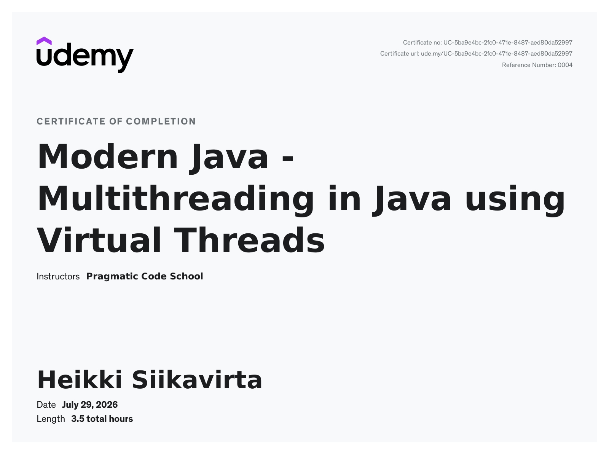
</div>

**Note: The material provided in this repository is only for helping those who may get stuck at any point of time in the course. It is very advised that no one should just copy the solutions(violation of Honor Code) presented here.**

#### Progress/Curriculum.

- [x] [Section 01](https://github.com/developersCradle/data-structures-algorithms-and-java-multithreading-concurrency-performance-optimization/tree/main/Modern%20Java%20%20Multithreading%20in%20Java%20using%20Virtual%20Threads/Section%2001#chapter-01-getting-started-with-the-course) - Getting Started With the Course. ✅
- [x] [Section 02](https://github.com/developersCradle/data-structures-algorithms-and-java-multithreading-concurrency-performance-optimization/tree/main/Modern%20Java%20%20Multithreading%20in%20Java%20using%20Virtual%20Threads/Section%2002#chapter-02-course-slides-and-source-code) - Course Slides and Source Code. ✅
- [x] [Section 03](https://github.com/developersCradle/data-structures-algorithms-and-java-multithreading-concurrency-performance-optimization/tree/main/Modern%20Java%20%20Multithreading%20in%20Java%20using%20Virtual%20Threads/Section%2003#chapter-03-getting-started-with-java-threads-platform-threads) - Getting Started with Java Threads (Platform Threads). ✅
- [x] [Section 04](https://github.com/developersCradle/data-structures-algorithms-and-java-multithreading-concurrency-performance-optimization/tree/main/Modern%20Java%20%20Multithreading%20in%20Java%20using%20Virtual%20Threads/Section%2004#chapter-04---getting-started-with-virtual-threads) - Getting Started with Virtual Threads. ✅
- [x] [Section 05](https://github.com/developersCradle/data-structures-algorithms-and-java-multithreading-concurrency-performance-optimization/tree/main/Modern%20Java%20%20Multithreading%20in%20Java%20using%20Virtual%20Threads/Section%2005#chapter-05---future-and-completablefuture) - Future and CompletableFuture. ✅
- [x] [Section 06](https://github.com/developersCradle/data-structures-algorithms-and-java-multithreading-concurrency-performance-optimization/tree/main/Modern%20Java%20%20Multithreading%20in%20Java%20using%20Virtual%20Threads/Section%2006#chapter-06---structured-concurrency-using-virtual-threads-preview-feature) - Structured Concurrency using Virtual Threads (Preview Feature). ✅
- [x] [Section 07](https://github.com/developersCradle/data-structures-algorithms-and-java-multithreading-concurrency-performance-optimization/tree/main/Modern%20Java%20%20Multithreading%20in%20Java%20using%20Virtual%20Threads/Section%2007#chapter-07---http-calls-using-virtual-threads) - HTTP calls using Virtual Threads. ✅
- [x] [Section 08](https://github.com/developersCradle/data-structures-algorithms-and-java-multithreading-concurrency-performance-optimization/tree/main/Modern%20Java%20%20Multithreading%20in%20Java%20using%20Virtual%20Threads/Section%2008#chapter-08---using-futures-with-virtual-threads) - Using Futures with Virtual Threads. ✅
- [x] [Section 09](https://github.com/developersCradle/data-structures-algorithms-and-java-multithreading-concurrency-performance-optimization/tree/main/Modern%20Java%20%20Multithreading%20in%20Java%20using%20Virtual%20Threads/Section%2009#chapter-09---build-a-spring-boot-application-using-virtual-threads) - Build a Spring Boot Application using Virtual Threads. ✅
- [x] [Section 10](https://github.com/developersCradle/data-structures-algorithms-and-java-multithreading-concurrency-performance-optimization/tree/main/Modern%20Java%20%20Multithreading%20in%20Java%20using%20Virtual%20Threads/Section%2010#chapter-10---load-test-using-ab--apache-http-server-benchmarking-tool) - Load Test using `ab` – Apache HTTP server benchmarking tool. ✅

#### Additional stuff.

- Original [Repo](https://github.com/dilipsundarraj1/modern-java-concurrency/tree/main?tab=readme-ov-file)!

#### The Quizzes and Labs.

* **Section 04**:
    * *Quiz*:
        * [Quiz 01: Platform Threads and Virtual Threads](#).


<p align="center">
    
</p>

<p align="center">
    
</p> 

All course material from *Java Application Performance Tuning and Memory Management* by from **Matt Greencroft** ... Sir **Matt Greencroft** and **Virtual Pair Programmers**.

> I interviewed with 🔴**Polar**🔴 for an Advanced Java role, and the technical discussion immediately dove into multithreading, concurrency, and performance optimization. They asked about thread pools, synchronization strategies, deadlocks, optimizing CPU-bound versus IO-bound operations, and even Virtual Threads in Java. The questions were challenging and required more than just textbook knowledge — they wanted practical understanding of real-world thread behavior.
>
> Thanks to a recent course on *Java Multithreading, Concurrency & Performance Optimization*, I could confidently discuss thread-safe collections, locks, executor frameworks, and the advantages of Virtual Threads for scalable, lightweight concurrency. Even though I was **not chosen** for the position, the interview **drove me** to deeply pursue these concepts, strengthening my skills and confidence for future challenges. <br><br>
~ *DevelopersCradle*

Contains my own with my own visual notes ✍️ with some course material to enforce learning experience.

This repository is made with [](#) with [](#) hotkeys, therefore it will include configuration files which are related to this IDE this approach will be favored for now. ⚙️

We are using [](https://github.com/developersCradle/data-structures-algorithms-and-java-multithreading-concurrency-performance-optimization/tree/main/Java%20Application%20Performance%20Tuning%20and%20Memory%20Management/Section%2001#example-code-provided-with-this-course). Instead, the which are recommended!

[Udemy course](https://www.udemy.com/course/java-application-performance-and-memory-management).

[Homepage of maker](https://www.virtualpairprogrammers.com/).

If the content sparked :fire: your interest, please consider starting the course and start learning :book:.

<!-- 
Linkedin puts this shit front, when clicking from private mode x(. Need to put this to make jump working every case
?trk=public_profile_see-credential 
-->

<div align="center">
    Insert certificate here when completed
</div>

**Note: The material provided in this repository is only for helping those who may get stuck at any point of time in the course. It is very advised that no one should just copy the solutions(violation of Honor Code) presented here.**

#### Progress/Curriculum.

- [x] [Chapter 01](https://github.com/developersCradle/data-structures-algorithms-and-java-multithreading-concurrency-performance-optimization/tree/main/Java%20Application%20Performance%20Tuning%20and%20Memory%20Management/Section%2001#chapter-01---introduction) - Introduction. ✅
- [ ] [Chapter 02](https://github.com/developersCradle/data-structures-algorithms-and-java-multithreading-concurrency-performance-optimization/blob/main/Java%20Application%20Performance%20Tuning%20and%20Memory%20Management/Section%2002/README.md#section-02-just-in-time-compilation-and-the-code-cache) - Just In Time Compilation and the Code Cache. ⚠️ In progress! ⚠️
- [ ] [Chapter 03](https://github.com/developersCradle/data-structures-algorithms-and-java-multithreading-concurrency-performance-optimization/tree/main/Java%20Application%20Performance%20Tuning%20and%20Memory%20Management/Section%2003#chapter-03-selecting-the-jvm) - Selecting the JVM.
- [ ] [Chapter 04](https://github.com/developersCradle/data-structures-algorithms-and-java-multithreading-concurrency-performance-optimization/blob/main/Java%20Application%20Performance%20Tuning%20and%20Memory%20Management/Section%2004/README.md#chapter-04-how-memory-works-the-stack-and-the-heap) - How memory works: the stack and the heap.
- [ ] [Chapter 05](#) - Passing objects between methods.
- [ ] [Chapter 06](#) - Memory exercise.
- [ ] [Chapter 07](#) - Escaping References.
- [ ] [Chapter 08](#) - Memory Exercise.
- [ ] [Chapter 09](#) - The Metaspace and internal JVM memory optimisations.
- [ ] [Chapter 10](#) - Tuning the JVM’s Memory Settings.
- [ ] [Chapter 11](#) - Introducing Garbage Collection.
- [x] [Chapter 12](https://github.com/developersCradle/data-structures-algorithms-and-java-multithreading-concurrency-performance-optimization/tree/main/Java%20Application%20Performance%20Tuning%20and%20Memory%20Management/Section%2012#chapter-12---monitoring-the-heap) - Monitoring the Heap. ✅
- [x] [Chapter 13](https://github.com/developersCradle/data-structures-algorithms-and-java-multithreading-concurrency-performance-optimization/tree/main/Java%20Application%20Performance%20Tuning%20and%20Memory%20Management/Section%2013#chapter-13---analyzing-a-heap-dump) - Analyzing a heap dump. ✅
- [ ] [Chapter 14](#) - Generational Garbage Collection.
- [ ] [Chapter 15](#) - Garbage Collector tuning & selection.
- [ ] [Chapter 16](#) - Using a profiler to analyse application performance.
- [ ] [Chapter 17](#) - Assessing Performance.
- [ ] [Chapter 18](#) - Benchmarking with JMH.
- [ ] [Chapter 19](#) - Performance and Benchmarking Exercise.
- [ ] [Chapter 20](#) - How Lists Work.
- [ ] [Chapter 21](https://github.com/developersCradle/data-structures-algorithms-and-java-multithreading-concurrency-performance-optimization/tree/main/Java%20Application%20Performance%20Tuning%20and%20Memory%20Management/Section%2021#chapter-21---how-maps-work) - How Maps Work. ⚠️ In progress! ⚠️

#### Additional stuff.

- Remove the `Codes` folder after course is finished!
- [ ] Check the content from other student, if there is missing or broken material. [Link](https://github.com/tommic81/udemy-java-memory-management/tree/master).
- [ ] Heap Dump Analysis Using Eclipse MAT. [Link](Heap Dump Analysis Using Eclipse MAT).
- Do the chapters `The structure of this course`.
- Finish this after this course is finished `Solving Memory Leaks in the JVM`. (add here the link)
- [ ] Read thought. [Link](https://www.baeldung.com/java-memory-leaks).
- [ ] Check this memory leak course after this course. [Link](https://www.linkedin.com/learning/java-memory-management-garbage-collection-jvm-tuning-and-spotting-memory-leaks).
- [ ] Check second this memory leak course after this course. [Link](https://www.oreilly.com/live-events/memory-efficient-java/0636920457060/).
- [ ] Check third this memory leak course after this course. [Link](https://www.pluralsight.com/courses/java-understanding-solving-memory-problems?utm_source=chatgpt.com).
- [ ] Check Java Memory Leaks by Victor Rentea. [Link](https://www.youtube.com/watch?v=-0vkHxlGlOU).
- [ ] Check. [Link](https://www.youtube.com/watch?v=W4SvLYU9H1I&list=PLQh1c87p_Wlp7GgRQEf3907LnxxsrbX3R).

#### The Quizzes and Labs.

* **Section 01**:
    - check this one.
* **Section 02**:
    * *Example*:
        * [Performance example one codes](https://github.com/developersCradle/data-structures-algorithms-and-java-multithreading-concurrency-performance-optimization/blob/main/Java%20Application%20Performance%20Tuning%20and%20Memory%20Management/Section%2002/README.md#JIT%20logs%20example%20one%20codes).
        * [Performance example second codes](https://github.com/developersCradle/data-structures-algorithms-and-java-multithreading-concurrency-performance-optimization/blob/main/Java%20Application%20Performance%20Tuning%20and%20Memory%20Management/Section%2002/README.md#JIT%20logs%20example%20second%20codes).
    * *Logs*:
        * [Performance example second logs](https://github.com/developersCradle/data-structures-algorithms-and-java-multithreading-concurrency-performance-optimization/blob/main/Java%20Application%20Performance%20Tuning%20and%20Memory%20Management/Section%2002/README.md#JIT%20logs%20example%20second%20logs).
        * [Performance logs from the logCompilation](https://github.com/developersCradle/data-structures-algorithms-and-java-multithreading-concurrency-performance-optimization/blob/main/Java%20Application%20Performance%20Tuning%20and%20Memory%20Management/Section%2002/hotspot_pid11876.log).


<p align="center">
    
</p> 

<p align="center">
    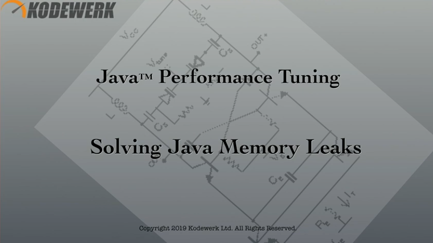
</p>

All course material from *Solving Memory Leaks in the JVM* by **Kirk Pepperdine**!

> Add story here <br><br>
~ *DevelopersCradle*

Contains my own with my own visual notes ✍️ with some course material to enforce learning experience.

<!-- add this comment later 
This repository is made with [](#), therefore it will include configuration files which are related to this IDE this approach will be favored for now. ⚙️ -->

[The series at YouTube](https://www.youtube.com/watch?v=_gineh_HcoQ). 

If the content sparked :fire: your interest, please consider buying the course and start learning :book:.

<!-- 
Linkedin puts this shit front, when clicking from private mode x(. Need to put this to make jump working every case
?trk=public_profile_see-credential 
-->

<div align="center">
    Insert certificate here when completed
</div>

**Note: The material provided in this repository is only for helping those who may get stuck at any point of time in the course. It is very advised that no one should just copy the solutions(violation of Honor Code) presented here.**

#### Progress/Curriculum.

- [x] [Section 01](#) - . ⚠️ In progress! ⚠️

#### Additional stuff.

- [ ] Todo.
    
<p align="center">
    
</p>

<p align="center">
    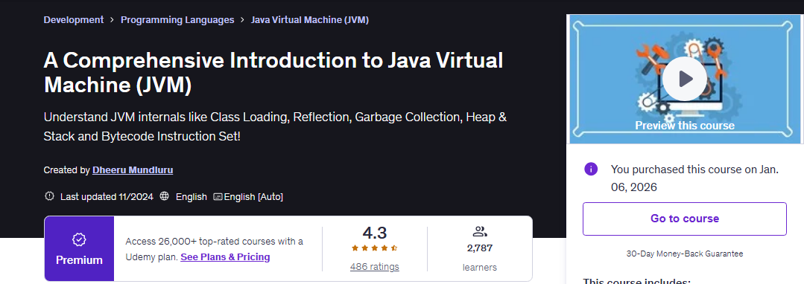
</p>

All course material from A Comprehensive Introduction to Java Virtual Machine (JVM) by **Dheeru Mundluru**.

> Once I saw one 👓<b>requirement</b>👓 in the job posting, this lead me get more comfortable at the JVM internals.
>
>*"How you would tune the JVM for Garbage Collection (GC) overhead in latency-sensitive applications?"*
>
> Sony evaluates candidates on real-world scalability, debugging under pressure, and system performance rather than just "textbook answers". <br><br>
> ~ *DevelopersCradle*

Contains my own with my own visual notes ✍️ with some course material to enforce learning experience.

This repository is made with [](#) with [](#) hotkeys, therefore it will include configuration files which are related to this IDE this approach will be favored for now. ⚙️

[The course at Udemy](https://www.udemy.com/course/a-comprehensive-introduction-to-java-virtual-machine-jvm/?couponCode=CP250105G1). 

[Website of maker](https://www.semanticsquare.com/).

If the content sparked :fire: your interest, please consider buying the course and start learning :book:.

<!-- 
Linkedin puts this shit front, when clicking from private mode x(. Need to put this to make jump working every case
?trk=public_profile_see-credential 
-->

<div align="center">
    Insert certificate here when completed
</div>

**Note: The material provided in this repository is only for helping those who may get stuck at any point of time in the course. It is very advised that no one should just copy the solutions(violation of Honor Code) presented here.**

#### Progress/Curriculum.

- [ ] [Section 01](#) - Background ~ A High-level Overview on JVM. ⚠️ In progress! ⚠️
- [ ] [Section 02](#) - Lifetime of a Type.
- [ ] [Section 03](#) - Reflection.
- [ ] [Section 04](#) - JVM Memory, Garbage Collection, and Bytecode Instructions.
- [ ] [Section 05](#) - Strings & JVM.
- [ ] [Section 06](#) - Bonus Chapter.

#### Additional stuff.

- [ ] After this answer, the questions from Sony!
- [ ] After this check the blog [JVM Anatomy Quarks](https://shipilev.net/jvm/anatomy-quarks/)!


<details>

<summary id="Sony_Interview_Questions" open="true"> <i>The requirements, which drove me to pursies this course, from <b>Sony!</b></summary>

<br>

<p align="center">
    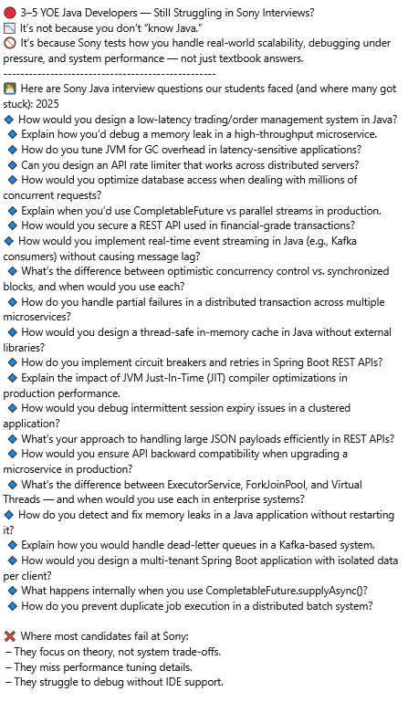
</p>

</details>

#### The Quizzes and Labs.

* **Section 01**:
    * *Quiz*:
        * [Some here](#).
    * *Coding Exercise*:
        * [Some here](#).

<p align="center">
    
</p>

<p align="center">
    
</p>

All course material from *Data Structures and Algorithms with Visualizations with Java* by from **Dinesh Varyani**.

> Add here some <br><br>
~ *DevelopersCradle*

Contains my own with my own visual notes ✍️ with some course material to enforce learning experience.

This repository is made with [](#), therefore it will include configuration files which are related to this IDE this approach will be favored for now. ⚙️

**Main**: [YouTube Source](https://www.youtube.com/playlist?list=PLe8LZCtW06l-WqVgtvL2Y_4BRrxcEbsg_).

**Optional**: [freeCodeCamp](https://www.freecodecamp.org/news/learn-data-structures-and-algorithms-2/).

**Optional**: [YouTube Source](https://www.youtube.com/playlist?list=PLe8LZCtW06l-WqVgtvL2Y_4BRrxcEbsg_).

[Source Codes](https://github.com/dinesh-varyani/ds-algos).

If the content sparked :fire: your interest, please consider starting the course and start learning :book:.

<!-- 
Linkedin puts this shit front, when clicking from private mode x(. Need to put this to make jump working every case
?trk=public_profile_see-credential 
-->

<div align="center">
    Insert certificate here when completed
</div>

**Note: The material provided in this repository is only for helping those who may get stuck at any point of time in the course. It is very advised that no one should just copy the solutions(violation of Honor Code) presented here.**

#### Progress/Curriculum.

- [x] Section 00 - Data Structures and Algorithms with Visualizations. ✅
- [x] [Section 01](https://github.com/developersCradle/data-structures-and-algorithms/tree/main/01%20Introduction%20to%20Data%20Structures) - Introduction to Data Structures. ✅
- [x] [Section 02](https://github.com/developersCradle/data-structures-and-algorithms/tree/main/02%20Introduction%20to%20Algorithms) - Introduction to Algorithms. ✅
- [x] [Section 03](https://github.com/developersCradle/data-structures-and-algorithms/tree/main/03%20Introduction%20to%20Algorithm%20Analysis) - Introduction to Algorithm Analysis. ✅
- [x] [Section 04](https://github.com/developersCradle/data-structures-and-algorithms/tree/main/04%20Time%20Complexity%20of%20an%20Algorithm) - Time Complexity of an Algorithm. ✅
- [x] [Section 05](https://github.com/developersCradle/data-structures-and-algorithms/tree/main/05%20Space%20Complexity%20of%20an%20Algorithm) - Space Complexity of an Algorithm. ✅
- [x] [Section 06](https://github.com/developersCradle/data-structures-and-algorithms/tree/main/06%20Asymptotic%20Analysis%20of%20an%20Algorithm) - Asymptotic Analysis of an Algorithm. ✅
- [x] [Section 07](https://github.com/developersCradle/data-structures-and-algorithms/tree/main/07%20Aymptotic%20Notations%2C%20Omega%2C%20Theta%20and%20Big%20O%20Notation) - Asymptotic Notations | Omega, Theta and Big O Notations. ✅
- [x] [Section 08](https://github.com/developersCradle/data-structures-and-algorithms/tree/main/08%20Types%20of%20Asymptotic%20Notations) - Types of Asymptotic Notations. ✅
- [x] [Section 09](https://github.com/developersCradle/data-structures-and-algorithms/tree/main/09%20Calculating%20Time%20complexity%20of%20Constant%20Algorithm%20(Big%20O)) - Analysis and Rules to calculate Big O notation. ✅
- [x] [Section 10](https://github.com/developersCradle/data-structures-and-algorithms/tree/main/10%20Calculating%20Time%20complexity%20of%20Constant%20Algorithm%20(Big%20O)) - Calculating Time complexity of Constant Algorithm (Big O). ✅
- [x] [Section 11](https://github.com/developersCradle/data-structures-and-algorithms/tree/main/11%20Calculating%20Time%20complexity%20of%20a%20Linear%20Algorithm%20(Big%20O)) - Calculating Time complexity of a Linear Algorithm (Big O). ✅
- [x] [Section 12](https://github.com/developersCradle/data-structures-and-algorithms/tree/main/12%20Calculating%20Time%20complexity%20of%20a%20Polynomial%20Algorithm%20(Big%20O)) - Calculating Time complexity of a Polynomial Algorithm (Big O). ✅
- [x] [Section 13](https://github.com/developersCradle/data-structures-and-algorithms/tree/main/13%20Introduction%20to%20One-Dimensional%20Array) - Introduction to One-Dimensional Array. ✅
- [x] [Section 14](https://github.com/developersCradle/data-structures-and-algorithms/tree/main/14%20Declaration%20and%20Initialization%20of%20a%20One-Dimensional%20Array) - Declaration and Initialization of a One-Dimensional Array. ✅
- [x] [Section 15](https://github.com/developersCradle/data-structures-and-algorithms/tree/main/15%20Adding%20or%20Updating%20elements%20in%20a%20One-Dimensional%20Array%20and%20Implementatio) - Adding or Updating elements in a One-Dimensional Array | Implementation. ✅
- [x] [Section 16](https://github.com/developersCradle/data-structures-and-algorithms/tree/main/16%20How%20to%20print%20elements%20of%20an%20Array%20in%20Java.%20Animation) - How to print elements of an Array in Java? | Animation. ✅
- [x] [Section 17](https://github.com/developersCradle/data-structures-and-algorithms/tree/main/17%20How%20to%20print%20elements%20of%20an%20Array%20in%20Java.%20Implementation) - How to print elements of an Array in Java? | Implementation ✅
- [x] [Section 18](https://github.com/developersCradle/data-structures-and-algorithms/tree/main/18%20Remove%20Even%20Integers%20from%20an%20Array.%20Animation.%20Coding%20Interview%20Question) - **Remove Even Integers** from an Array | Animation | Coding Interview Question. ✅
- [x] [Section 19](https://github.com/developersCradle/data-structures-and-algorithms/tree/main/19%20Remove%20Even%20Integers%20from%20an%20Array.%20Implementation%20Coding.%20Interview%20Question) - **Remove Even Integers** from an Array | Implementation | Coding Interview Question. ✅
- [x] [Section 20](https://github.com/developersCradle/data-structures-and-algorithms/tree/main/20%20How%20to%20Reverse%20an%20Array%20in%20Java%20-%20Animation) - How to **Reverse an Array** in Java - Animation. ✅
- [x] [Section 21](https://github.com/developersCradle/data-structures-and-algorithms/tree/main/21%20How%20to%20reverse%20an%20array%20in%20Java.%20Implementation) - How to **Reverse an Array** in Java? | Implementation. ✅
- [ ] [Section 22](https://github.com/developersCradle/data-structures-and-algorithms/tree/main/22%20How%20to%20find%20Minimum%20value%20in%20an%20Array.%20Animation) - How to find Minimum value in an Array? | Animation. ✅
- [ ] [Section 23](https://github.com/developersCradle/data-structures-and-algorithms/tree/main/23%20How%20to%20find%20Minimum%20value%20in%20an%20Array.%20%20Implementation) - How to find Minimum value in an Array? | Implementation.
- [ ] [Section 24](#) -
- [ ] [Section 25](#) -
- [ ] [Section 26](#) -
- [ ] [Section 27](#) -
- [ ] [Section 28](#) -
- [ ] [Section 29](#) -
- [ ] [Section 30](#) -
- [ ] [Section 31](#) -
- [ ] [Section 32](#) -
- [ ] [Section 33](#) -
- [ ] [Section 34](#) -
- [ ] [Section 35](#) -
- [x] [Section 36](https://github.com/developersCradle/data-structures-and-algorithms/tree/main/36%20Represent%20a%20Singly%20Linked%20List) - Represent a **Singly Linked List** in Java. ✅
- [x] [Section 37](https://github.com/developersCradle/data-structures-and-algorithms/tree/main/37%20How%20to%20Implement%20a%20Singly%20Linked%20List%20in%20Java.%20Data%20Structures%20and%20Algorithms) - How to Implement a **Singly Linked List** in Java | **Data Structures** and Algorithms. ✅
- [x] [Section 38](https://github.com/developersCradle/data-structures-and-algorithms/tree/main/38%20Create%20a%20Singly%20Linked%20List%20in%20Java%20(Animation)) - Create a **Singly Linked List** in Java (Animation). ✅
- [x] [Section 39](https://github.com/developersCradle/data-structures-and-algorithms/tree/main/39%20Create%20a%20Singly%20Linked%20List%20in%20Java%20(Implementation)) - Create a **Singly Linked List** in Java (Implementation). ✅
- [x] [Section 40](https://github.com/developersCradle/data-structures-and-algorithms/tree/main/40%20Print%20elements%20of%20a%20Singly%20Linked%20List%20in%20Java%20(Animation)) - Print elements of a **Singly Linked List** in Java (Animation). ✅
- [x] [Section 41](https://github.com/developersCradle/data-structures-and-algorithms/tree/main/41%20Print%20elements%20of%20a%20Singly%20Linked%20List%20in%20Java%20(Implementation)) - Print elements of a **Singly Linked List** in Java (Implementation).

#### Additional stuff.

- [ ] Add first captions for all the chapters, like `#someThing`, so can be linked.

<p align="center">
    
</p>

<p align="center">
    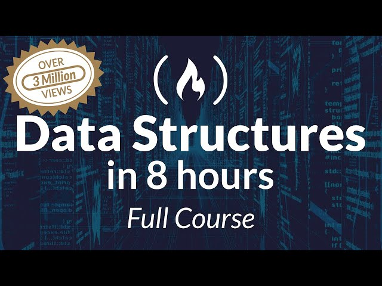
</p>

todo this desc.

>
> add here the story
>

Contains my own with my own visual notes ✍️ with some course material to enforce learning experience.

This repository is made with [](#) with [](#) hotkeys, therefore it will include configuration files which are related to this IDE this approach will be favored for now. ⚙️

[freeCodeCamp](https://www.freecodecamp.org/news/learn-data-structures-from-a-google-engineer/).

[GitHub repo](https://github.com/williamfiset/DEPRECATED-data-structures).

If the content sparked :fire: your interest, please consider buying the course and start learning :book:.

<!-- 
Linkedin puts this shit front, when clicking from private mode x(. Need to put this to make jump working every case
?trk=public_profile_see-credential 
-->

<div align="center">
    Insert certificate here when completed
</div>

**Note: The material provided in this repository is only for helping those who may get stuck at any point of time in the course. It is very advised that no one should just copy the solutions(violation of Honor Code) presented here.**

#### Progress/Curriculum.

- [ ] [Section 01](#) - Abstract data types.
- [ ] [Section 02](#) - Introduction to Big-O.
- [ ] [Section 03](#) - Dynamic and Static Arrays.
- [ ] [Section 04](#) - Dynamic Array Code.
- [ ] [Section 05](#) - Linked Lists Introduction.
- [ ] [Section 06](#) - Doubly Linked List Code.
- [ ] [Section 07](#) - Stack Introduction.
- [ ] [Section 08](#) - Stack Implementation.
- [ ] [Section 09](#) - Stack Code.
- [ ] [Section 10](#) - Queue Introduction.
- [ ] [Section 11](#) - Queue Implementation.
- [ ] [Section 12](#) - Queue Code.
- [ ] [Section 13](#) - Priority Queue Introduction.
- [ ] [Section 14](#) - Priority Queue Min Heaps and Max Heaps.
- [ ] [Section 15](#) - Priority Queue Inserting Elements.
- [ ] [Section 16](#) - Priority Queue Removing Elements.
- [ ] [Section 17](#) - Priority Queue Code.
- [ ] [Section 18](#) - Union Find Introduction.
- [ ] [Section 19](#) - Union Find Kruskal's Algorithm.
- [ ] [Section 20](#) - Union Find - Union and Find Operations.
- [ ] [Section 21](#) - Union Find Path Compression.
- [ ] [Section 22](#) - Union Find Code.
- [ ] [Section 23](#) - Binary Search Tree Introduction.
- [ ] [Section 24](#) - Binary Search Tree Insertion.
- [ ] [Section 25](#) - Binary Search Tree Removal.
- [ ] [Section 26](#) - Binary Search Tree Traversals.
- [ ] [Section 27](#) - Binary Search Tree Code.
- [ ] [Section 28](#) - Hash table hash function.
- [ ] [Section 29](#) - Hash table separate chaining.
- [ ] [Section 30](#) - Hash table separate chaining source code.
- [ ] [Section 31](#) - Hash table open addressing.
- [ ] [Section 32](#) - Hash table linear probing.
- [ ] [Section 33](#) - Hash table quadratic probing.
- [ ] [Section 34](#) - Hash table double hashing.
- [ ] [Section 35](#) - Hash table open addressing removing.
- [ ] [Section 36](#) - Hash table open addressing code.
- [ ] [Section 37](#) - Fenwick Tree range queries.
- [ ] [Section 38](#) - Fenwick Tree point updates.
- [ ] [Section 39](#) - Fenwick Tree construction.
- [ ] [Section 40](#) - Fenwick tree source code.
- [ ] [Section 41](#) - Suffix Array introduction.
- [ ] [Section 42](#) - Longest Common Prefix (LCP) array.
- [ ] [Section 43](#) - Suffix array finding unique substrings.
- [ ] [Section 44](#) - Longest common substring problem suffix array.
- [ ] [Section 45](#) - Longest common substring problem suffix array part 2.
- [ ] [Section 46](#) - Longest Repeated Substring suffix array.
- [ ] [Section 47](#) - Balanced binary search tree rotations.
- [ ] [Section 48](#) - AVL tree insertion.
- [ ] [Section 49](#) - AVL tree removals.
- [ ] [Section 50](#) - AVL tree source code.
- [ ] [Section 51](#) - Indexed Priority Queue | Data Structure.
- [ ] [Section 52](#) - Indexed Priority Queue | Data Structure | Source Code.

#### Additional stuff.

- [ ] Add some.

#### The Quizzes and Labs.

* **Section 01**:
    * *Quiz*:
        * [Some here](#).
    * *Coding Exercise*:
        * [Some here](#).

<p align="center">
    
</p>

<p align="center">
    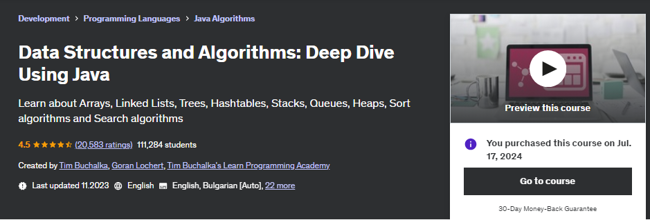
</p>

All course material from *Data Structures and Algorithms: Deep Dive Using Java* by **Goran Lochert**, **Tim Buchalka** and **Tim Buchalka's Learn Programming Academy**.

> I once interviewed with 🌤️**Vaisala**🌤️ for the *Observation Network Manager NM10* role, where the technical discussion went deep into data structures and their operations. The interview challenged my understanding of trees, graphs, and time–space trade-offs in ways I hadn’t fully experienced before. [Project](https://www.vaisala.com/en/products/weather-environmental-sensors/observation-network-manager-nm10).
>
> Although I **wasn’t** selected for the position, the experience became a turning point. It drove me to truly internalize the concepts through a deep dive into *Data Structures and Algorithms using Java*, strengthening both my problem-solving approach and technical confidence for future challenges.
<br><br>
~ *DevelopersCradle*

Contains my own with my own visual notes ✍️ with some course material to enforce learning experience.

This repository is made with [](#) with [](#) hotkeys. This is why it will include configuration files which are related to this IDE this approach will be favored for now. ⚙️

[The course at Udemy](https://www.udemy.com/course/data-structures-and-algorithms-deep-dive-using-java). 

[Website of maker 01](https://www.timbuchalka.com/).

[Website of maker 02](https://jojoguruacademy.blogspot.com/).

[Website of maker 03](https://learnprogramming.academy/).

If the content sparked :fire: your interest, please consider buying the course and start learning :book:.

<!-- 
Linkedin puts this shit front, when clicking from private mode x(. Need to put this to make jump working every case
?trk=public_profile_see-credential 
-->

<div align="center">
    Insert certificate here when completed
</div>

**Note: The material provided in this repository is only for helping those who may get stuck at any point of time in the course. It is very advised that no one should just copy the solutions(violation of Honor Code) presented here.**

#### Progress/Curriculum.

- [x] [Section 01](https://github.com/developersCradle/data-structures-algorithms-and-java-multithreading-concurrency-performance-optimization/tree/main/Data%20Structures%20and%20Algorithms%20Deep%20Dive%20Using%20Java/Section%2001#section-1---introduction) - Introduction. ✅
- [ ] [Section 02](https://github.com/developersCradle/data-structures-algorithms-and-java-multithreading-concurrency-performance-optimization/tree/main/Data%20Structures%20and%20Algorithms%20Deep%20Dive%20Using%20Java/Section%2002#section-2---arrays-and-big-o-notation) - Arrays and Big-O Notation.
- [ ] [Section 03](#) - Sort Algorithms Deep Dive.
- [ ] [Section 04](#) - Mastering Lists in Java: Implementations and Applications.
- [ ] [Section 05](#) - Stack Data Structures: Implementation and Use Cases.
- [ ] [Section 06](#) - Mastering Queue Data Structures: Implementation and Applications in Java.
- [ ] [Section 07](#) - Hash Tables: Mastering Key-Value Data Structures for Efficient Data Retrieval.
- [ ] [Section 08](#) - Optimized Search Algorithms in Java: Linear and Binary Search.
- [ ] [Section 09](#) - Mastering Tree Data Structures: Implementation and Optimization in Java.
- [ ] [Section 10](#) - Mastering Heaps: Priority Queues and Heapsort Algorithm in Java.
- [ ] [Section 11](#) - Final Section: Concluding the Course with Key Takeaways and Sets.
- [ ] [Section 12](#) - Extra Information - Source code, and other stuff.

#### Additional stuff.

- [ ] Add some.

#### The Quizzes and Labs.

* **Section 01**:
    * *Quiz*:
        * [Some here](#).
    * *Coding Exercise*:
        * [Some here](#).

<p align="center">
    
</p>

<p align="center">
    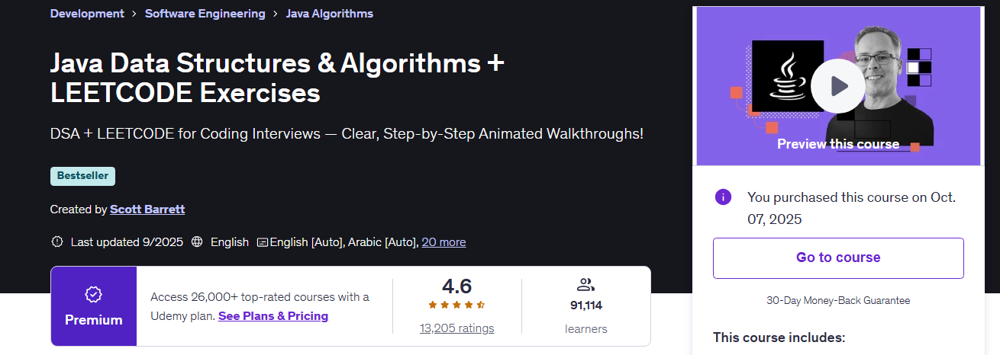
</p>

All course material from *Java Data Structures & Algorithms + LEETCODE Exercises* by **Scott Barrett**.

> Once I saw one 👀<b>requirement</b>👀 in the job posting, I realized that my *LeetCode* practice wasn’t just for fun—it directly built the skills the role demanded.
>
>*"Can you design a system that efficiently handles millions of inserts, deletes, and queries per second?"*
>
> Companies like Facebook evaluate candidates on their ability to apply data structures in both coding challenges and real-world system design—showing that mastering arrays, trees, and hash maps isn’t just academic, it’s practical. <br><br>
~ DevelopersCradle

Contains my own with my own visual notes ✍️ with some course material to enforce learning experience.

This repository is made with [](#) with [](#) hotkeys, therefore it will include configuration files which are related to this IDE this approach will be favored for now. ⚙️

[The course at Udemy](https://www.udemy.com/course/data-structures-and-algorithms-java). 

[Website of maker](https://scottbarrett.com/).

If the content sparked :fire: your interest, please consider buying the course and start learning :book:.

<!-- 
Linkedin puts this shit front, when clicking from private mode x(. Need to put this to make jump working every case
?trk=public_profile_see-credential 
-->

<div align="center">
    Insert certificate here when completed
</div>

**Note: The material provided in this repository is only for helping those who may get stuck at any point of time in the course. It is very advised that no one should just copy the solutions(violation of Honor Code) presented here.**

#### Progress/Curriculum.

- [x] [Section 01](https://github.com/developersCradle/data-structures-algorithms-and-java-multithreading-concurrency-performance-optimization/tree/main/Java%20Data%20Structures%20and%20Algorithms%20plus%20LEETCODE%20Exercises/Section%2001#chapter-01---introduction): Introduction. ✅
- [x] [Section 02](https://github.com/developersCradle/data-structures-algorithms-and-java-multithreading-concurrency-performance-optimization/tree/main/Java%20Data%20Structures%20and%20Algorithms%20plus%20LEETCODE%20Exercises/Section%2002#chapter-02-big-o): Big O. ✅
- [x] [Section 03](https://github.com/developersCradle/data-structures-algorithms-and-java-multithreading-concurrency-performance-optimization/tree/main/Java%20Data%20Structures%20and%20Algorithms%20plus%20LEETCODE%20Exercises/Section%2003#section-03---classes--references): Classes & References. ✅
- [ ] [Section 04](https://github.com/developersCradle/data-structures-algorithms-and-java-multithreading-concurrency-performance-optimization/blob/main/Java%20Data%20Structures%20and%20Algorithms%20plus%20LEETCODE%20Exercises/Section%2004/README.md#chapter-04-linked-lists): Linked Lists. ⚠️ In progress! ⚠️
- [ ] [Section 05](https://github.com/developersCradle/data-structures-algorithms-and-java-multithreading-concurrency-performance-optimization/tree/main/Java%20Data%20Structures%20and%20Algorithms%20plus%20LEETCODE%20Exercises/Section%2005#section-05-ll-coding-exercises): LL: Coding Exercises.
- [ ] [Section 06](#): LL: Interview / LeetCode Exercises.
- [ ] [Section 07](#): Doubly Linked Lists.
- [ ] [Section 08](#): DLL: Coding Exercises.
- [ ] [Section 09](#): DLL: Interview / LeetCode Exercises.
- [ ] [Section 10](#): Stacks & Queues.
- [ ] [Section 11](#): S&Q: Coding Exercises.
- [ ] [Section 12](#): S&Q: Interview / LeetCode Exercises.
- [ ] [Section 13](#): Trees.
- [ ] [Section 14](#): BST: Coding Exercises.
- [ ] [Section 15](#): BST: Interview / LeetCode Exercises.
- [ ] [Section 16](https://github.com/developersCradle/data-structures-algorithms-and-java-multithreading-concurrency-performance-optimization/tree/main/Java%20Data%20Structures%20and%20Algorithms%20plus%20LEETCODE%20Exercises/Section%2016#section-16-hash-tables): Hash Tables. ⚠️ In progress! ⚠️

#### The Quizzes and Labs.

* **Section 02**:
    * *Quiz*:
        * [Quiz 01: Big O](https://github.com/developersCradle/data-structures-algorithms-and-java-multithreading-concurrency-performance-optimization/blob/main/Java%20Data%20Structures%20and%20Algorithms%20plus%20LEETCODE%20Exercises/Section%2002/README.md#quiz-01-big-o).
    * *Coding Exercise*:
        * [Coding Exercise 01: Big O: O(n)](https://github.com/developersCradle/data-structures-algorithms-and-java-multithreading-concurrency-performance-optimization/blob/main/Java%20Data%20Structures%20and%20Algorithms%20plus%20LEETCODE%20Exercises/Section%2002/README.md#coding-exercise-01--big-o-on).

* **Section 05**:
    * *Coding Exercise*:
        * [Coding Exercise 02: LL: Constructor](https://github.com/developersCradle/data-structures-algorithms-and-java-multithreading-concurrency-performance-optimization/tree/main/Java%20Data%20Structures%20and%20Algorithms%20plus%20LEETCODE%20Exercises/Section%2005#coding-exercise-02-ll-constructor).
        * [Coding Exercise 03: LL: Append](#).
        * [Coding Exercise 04: LL: Remove Last](#).
        * [Coding Exercise 05: LL: Prepend](#).
        * [Coding Exercise 06: LL: Remove First](#).
        * [Coding Exercise 07: LL: Get](#).
        * [Coding Exercise 08: LL: Set](#).
        * [Coding Exercise 09: LL: Insert](#).
        * [Coding Exercise 10: LL: Remove](#).
        * [Coding Exercise 11: LL: Reverse](#).

* **Section 12**:
    * *Coding Exercise*:
        * [Coding Exercise 40: Stack: Push for a Stack That Uses an ArrayList (** Interview Question)](#).
        * [Coding Exercise 41: Stack: Pop for a Stack That Uses an ArrayList (** Interview Question)](#).
        * [Coding Exercise 42: Stack: Reverse String (** Interview Question)](#).
        * [Coding Exercise 43: Stack: Parentheses Balanced (** Interview Question)](#).
        * [Coding Exercise 44: Stack: Sort Stack (** Interview Question)](#).
        * [Coding Exercise 45: Queue Using Stacks: Enqueue (** Interview Question)](#).
        * [Coding Exercise 46: Queue Using Stacks: Dequeue (** Interview Question)](#).

* **Section 15**:
    * *Quiz*:
        * [...](#).
    * *Coding Exercise*:
        * [...](#).
* **Section 16**:
    * *Quiz*:
        * [Quiz 05: Hash Table Big O](#).
    * *Coding Exercise*:
        * [...](#).

#### Additional stuff.

- Whenever there is new **data structure** learned → Check the cheat sheet, in reflection!
    - [Check the cheat sheet](https://www.bigocheatsheet.com/).

<p align="center">
    
</p>

<p align="center">
    
</p>

> [!IMPORTANT]  
> ⚠️ Comfortable requirements, one can open text editor and write data structure like **Linked List**. ⚠️

<details>

<summary id="Must_Know_Fundementals_For_Algorithms" open="true"> <b> Must know fundementals! </b> </summary>

<p align="center">
    <br>
    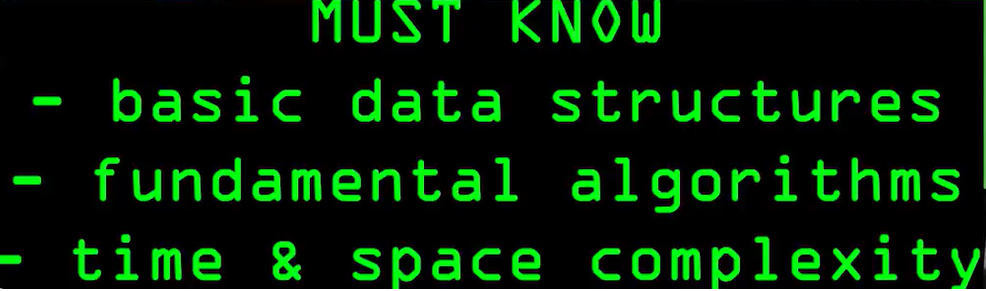
    <br>
</p>

</details>

<p align="center">
    
</p>

<p align="center">
    
</p>

All course material from *Introduction to Algorithms* by **Prof. Srini Devadas** and **Prof. Erik Demaine**.

> Add here some story <br><br>
~ *DevelopersCradle*

Contains my own with my own visual notes ✍️ with some course material to enforce learning experience.

This repository is made with [](#) with [](#) hotkeys, therefore it will include configuration files which are related to this IDE this approach will be favored for now. ⚙️

[Video playlist](https://www.youtube.com/playlist?list=PLe8LZCtW06l8z1RmbNIGA2Jg_ULeXyw46).

[Source page](https://ocw.mit.edu/courses/6-006-introduction-to-algorithms-fall-2011/).


If the content sparked :fire: your interest, please consider buying the course and start learning :book:.

<!-- 
Linkedin puts this shit front, when clicking from private mode x(. Need to put this to make jump working every case
?trk=public_profile_see-credential 
-->

<div align="center">
    Insert certificate here when completed
</div>

**Note: The material provided in this repository is only for helping those who may get stuck at any point of time in the course. It is very advised that no one should just copy the solutions(violation of Honor Code) presented here.**

#### Progress/Curriculum.

- [ ] [Section 01](#) - Add here.

#### Additional stuff.

- [ ] Don't get stuck of the proofs.

<hr>

# Data Structures and Algorithms Specialization.

<!-- <p align="center">
    
</p> -->

<p align="center">
    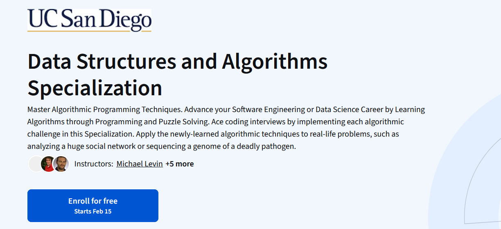
</p>

<!-- All course material from *Introduction to Algorithms* by **Prof. Srini Devadas** and **Prof. Erik Demaine**. -->

> Add here some story <br><br>
~ *DevelopersCradle*

Contains my own with my own visual notes ✍️ with some course material to enforce learning experience.

This repository is made with [](#) with [](#) hotkeys, therefore it will include configuration files which are related to this IDE this approach will be favored for now. ⚙️

<!-- [Video playlist](https://www.youtube.com/playlist?list=PLe8LZCtW06l8z1RmbNIGA2Jg_ULeXyw46).

[Source page](https://ocw.mit.edu/courses/6-006-introduction-to-algorithms-fall-2011/). -->


If the content sparked :fire: your interest, please consider buying the course and start learning :book:.

<!-- 
Linkedin puts this shit front, when clicking from private mode x(. Need to put this to make jump working every case
?trk=public_profile_see-credential 
-->

<div align="center">
    Insert certificate here when completed
</div>

**Note: The material provided in this repository is only for helping those who may get stuck at any point of time in the course. It is very advised that no one should just copy the solutions(violation of Honor Code) presented here.**

#### Progress/Curriculum.

- [ ] [Section 01](#) - Add here.

#### Additional stuff.

- [ ] Don't get stuck of the proofs.
- [ ] [Data Structures and Algorithms Specialization Review]( https://www.youtube.com/watch?v=qcKn3PZT20I
), is this worth it.
<hr>

- Can take this one [Algorithms Specialization](https://www.coursera.org/specializations/algorithmss).
    - Don't get stuck of the proofs, detail heavy.

- [Source](https://www.youtube.com/watch?v=9-ubSA9GA3o).

<hr>

- [Add this](https://www.youtube.com/playlist?list=PLI1t_8YX-ApvMthLj56t1Rf-Buio5Y8KL).

<hr>

- [Add this](https://www.youtube.com/watch?v=IhJGJG-9Dx8&list=PLI1t_8YX-Apv-UiRlnZwqqrRT8D1RhriX).

<hr>

#
<p align="center">
    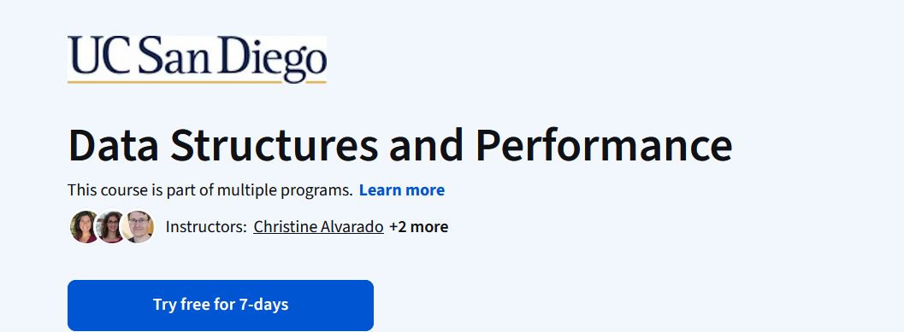
</p>

- [Add this](https://www.coursera.org/learn/data-structures-optimizing-performance?utm_source=chatgpt.com#outcomes).

